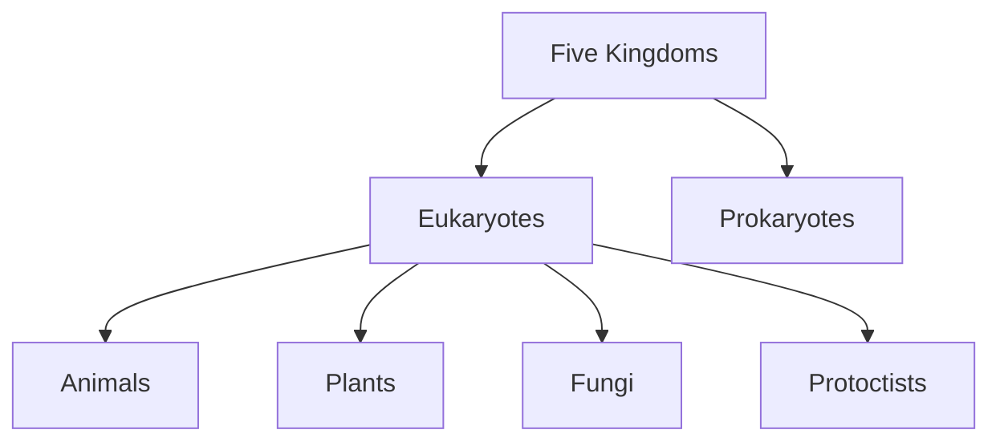

## 简单说明

这个笔记是我我本人（Tom）根据老师分享的课件和书本内容总结而成，主要在课件的基础上加上我自己的一些理解得来。如果有遇到有解释不清楚、知识点错误或遗漏等其他关于这篇笔记一系列其他问题的话，请随时联系我，这对我帮助很大。

以下是我计划要做但是还没有做的一些事情：

- [ ] 完善显微镜的内容（包括如何计算显微镜上的标尺，电子显微镜的类型等等）
- [ ] 等我把这个单元的笔记记完后喂给 AI，让 AI 生成一个单元摘要放在开头
- [ ] 找老师检查有没有错误或者遗漏的部分
- [ ] 让 AI 结合本篇笔记+单元总结+考纲之做一张知识点的 checklist

## 显微镜

### 制作临时的样本

- Cut thin sections of the material to be examined 切片
- Stain 染色
- Mount the specimen on a clean glass slide 放到载玻片上
- Lower the coverslip over the specimen (to prevent the specimen drying out) 覆盖

光学显微镜和电子显微镜的对比

| Feature             | Light Microscope           | Electron Microscope |
| ------------------- | -------------------------- | ------------------- |
| Source of radiation | Light                      | Electron            |
| Wavelength          | 400-700nm                  | ≈ 0.005nm           |
| Max. Resolution     | 200nm                      | 0.5nm (in practice) |
| Lenses              | Glass                      | Electromagnets      |
| Specimen            | Living, non-living or dead | non-living or dead  |
| Stains              | Coloured Dyes              | Heavy Metals        |
| Image               | Coloured                   | Monocolour          |
| Magnification       | x1500                      | x10 million         |
| Graph               | Photomicrograph            | Electron micrograph |

There are two types of electron microscope 有两种电子显微镜:

- Transmission Electron Microscope 穿透电子显微镜: 2D image, can see interior details 可以呈现出 2D 的图像，并且可以看到细胞内的结构。

- Scanning Electron Microscope 扫描电子显微镜: 3D image, can only see surface structures 可以看到细胞表面的 3D 结构。

### Magnification and Resolution

**Magnification 放大倍数**: the number of times **larger** an image is compared to the object's size. 图像比实物大多少倍。

**Resolution 分辨率**: The ability to **distinguish** between two separate points. 能分辨出两个很近的物体的能力。

The maximum resolution can be calculated from the wave length of radiation used to view the specimen.

最大的分辨率（分辨率的极限）能通过观察光的波长计算出来，例如使用波长为 500nm 的光观察一个物体，那么这个物体的最大分辨率为 250nm。

$$
Resolution = wavelength / 2
$$

## Animal and Plant cell

只能在电子显微镜下看到的结构（动物细胞）：

- Microvilli
- Golgi vesicle
- microtubules
- ribosome
- lysosome
- smooth ER
- rough ER
- nuclear pore
- nuclear envelope
- centrosome (only found in animal cells)

只能在电子显微镜下看到的结构（植物细胞）：

- Golgi vesicle
- lysosome
- chloroplast envelope
- microtubule
- rough ER
- nuclear envelope
- nuclear pore
- ribosome
- smooth ER

## 细胞器的功能

### Cell Surface Membrane / plasma Membrane 细胞膜

- Partially permeable / semi-permeable 半透的

- Control the exchange of materials between the cell and its environment

  控制进出细胞的物质

### Cell Wall 细胞壁

- Fully permeable 全透的 - All the substances can pass through it 全部物质都可以通过

- Protect and prevent the cell from bursting when water enters by osmosis

  防止细胞内水分太多时破裂

- Resist turgor pressure 抵抗膨压

- Cell wall is relatively rigid and gives the cell a definite shape

  细胞壁相对而言比较坚固，可以给细胞提供一个稳定的形状

- Cell wall of plant cells is made of cellulose

  植物的细胞壁由纤维素*(C₆H₁₀O₅)n*构成

### Plasmodesma (plural: plasmodesmata) 胞间连丝

- A pore-like structure 孔状的结构

- Plant cells are linked to neighbouring cells by plasmodesmata

  相邻的植物细胞通过胞间连丝相连

- Contain fine strands of cytoplasm, allowing the controlled passage of materials from one cell to the other

  含有细小的细胞质链，可以控制物质在细胞间的传输

### Cytoplasm 细胞质

The contents of a cell inside the cell surface membrane, excluding the nucleus. Cytoplasm contains organelles, e.g. ribosomes or mitochondrion

细胞质指的是细胞内除了细胞核之外的所有物质以及细胞器，像是 mitochondrion 和 robosome 之类的细胞器就被包括在细胞质里。

$$
Cytoplasm + Nucleus = Protoplasm
$$

**Cytosol** is the solution of the cytoplasm, in which the organelles are suspended.

**细胞溶质**是细胞质中的溶液，其中的细胞器都属于悬浮的状态。

> 如果把一个细胞想象成一杯珍珠奶茶，那么...
>
> - 奶茶杯 = Cell Surface Membrane
> - 奶茶以及加料 = Cytoplasm
> - 奶茶本身 = Cytosol
> - 加料 = Organelles

### Nucleus (plural: nuclei) 细胞核

- Contain the genetic material (DNA, chromatin and chromosome)

  包含遗传物质：DNA、染色质和染色体

- DNA contains the instructions / genes that control the activities of the cell, e.g. control **protein synthesis**

  DNA 含有细胞活动的指令（或基因），可以控制包括**蛋白质合成**等一系列活动

- Contains nucleolus (plural: nucleoli), one or more may be present in one nucleus

  包含一个或多个核仁

- Nucleolus is the place of making ribosome 核仁负责生产核糖体

$$
DNA + Proteins = Chromatin / Chromosome
$$

When a cell is not dividing/not during nuclear division, the material containing DNA is called chromatin. Chromatin is loosely coiled and thread-like. It’s long, thin and in a loose form.

when a cell is dividing/during nuclear division, the material containing DNA is called chromosomes. Chromosomes are condensedfrom chromatin. They are short and thick and in a condensed form.

| Feature              | Chromatin                                                                | Chromosome                                                   |
| :------------------- | :----------------------------------------------------------------------- | :----------------------------------------------------------- |
| **Presence**         | When the cell is **not dividing** / Interphase                           | When the cell **is dividing** / Mitotic phase                |
| **Morphology**       | Long, thin, loose, thread-like                                           | Short, thick, condensed, rod-shaped (or X, V-shaped)         |
| **Structural State** | **Extended**, uncondensed **long chains**                                | The final, **highly coiled and condensed** form              |
| **Composition**      | DNA + Histones (basic unit is the nucleosome)                            | Formed by the supercoiling and condensation of **chromatin** |
| **Primary Function** | Allows for DNA replication and transcription (directs protein synthesis) | Ensures DNA is **accurately distributed** to daughter cells  |
| **Visibility**       | Usually **not visible** under a light microscope                         | **Clearly visible** under a light microscope                 |

| 特征         | Chromatin (染色质)                      | Chromosome (染色体)                |
| :----------- | :-------------------------------------- | :--------------------------------- |
| **存在时期** | 细胞**不分裂**时 / 间期                 | 细胞**分裂**时 / 分裂期            |
| **形态**     | 细长、松散、丝状                        | 短粗、致密、棒状（或 X、V 等形状） |
| **结构状态** | **伸展**、未凝缩的**长链**              | **高度螺旋化、凝缩**后的最终形态   |
| **组成**     | DNA + 组蛋白（基本单位是核小体）        | 由**染色质**螺旋盘绕凝缩而成       |
| **主要功能** | 进行 DNA 的复制和转录（指导蛋白质合成） | 确保 DNA 被**精确分配**到子细胞中  |
| **可视性**   | 在光学显微镜下通常**不可见**            | 在光学显微镜下**清晰可见**         |

> 通常来说一个细胞只会有一个细胞核，但是每个细胞的情况不一样，例如：
>
> - 血红细胞为了运输氧气没有细胞核
> - 肝脏里的细胞有多个细胞核
> - Skeletal muscle cells 有多个细胞核
> - 部分真细胞有多个细胞核

The nucleus is surrounded by two membranes called the **nuclear envelope**, the nuclear envelope has many small pores called **nuclear pores**.

细胞核被一种叫做**核被膜**的“双膜”结构所包围，核被膜上的小孔成为**核孔**。

### Mitochondrion (plural: mitochondria) 线粒体

- surrounded by two membranes (a **mitochondrial envelope**).

  被**线粒体包膜**（一种双膜结构）包围

- The inner membrane is folded to form **cristae** (singular: **crista**) to increase surface area

  内层的膜会折叠成**cristae**（一种凸起的结构），用于增加表面积

- the interior of the mitochondrion is called the **matrix**

  线粒体中的内部区域被称为**matrix**，是主要进行有氧呼吸的场所

- The space between the two membranes is called the **intermembrane space**

  两层膜之间的空间被称为**膜间空间**

Cells with a high demand for energy, such as liver and muscle cells, contain large numbers of mitochondria.

在需要大量能量的细胞（例如肝脏细胞和肌肉细胞）中含有大量的线粒体。

Mitochondria carry out aerobic respiration to **release** energy/**produce** ATP.

线粒体会通过有氧呼吸**释放**能量/**产生**ATP。

> 注意：能量不可以被产生，只能转化。Energy can only be released, not produced
>
> ATP 是能量的载体，能量在 ATP 中被储存为化学势能（Chemical Potential Energy）

$$
\ce{C6H12O6 + 6O2 -> 6CO2 + 6H2O + energy}
$$

ATP produced in mitochondria is used for energy consuming activities in cells, such as muscle contraction, protein synthesis, exocytosis and active transport.

在线粒体中产生的 ATP 会在肌肉收缩、蛋白质合成、胞吐或主动运输等需要能量的细胞活动中消耗掉。

ATP 分子遇到水分子时会发生水解反应（Hydrolysis）：To break bonds between phosphate groups and release energy. 当分子间的化学键断裂时会释放能量。

在图片中线粒体有不同的形状，有的是圆形的，有的是胶囊形的，这是因为两个原因：

1. Mitochondria can change shape. 线粒体可以改变形状
2. They are cut at different angles. Some are cut through transverse section and some through longitudinal section. 展示的角度不一样，有的展示的是横切面，有的则是纵切面。

Many mitochondria are sausage-like. But they can change shape and divide.

大多数线粒体都是胶囊形（或者说“香肠形”的），但是它们仍然可以变换形状

### Chloroplast 叶绿体

> Inside the chloroplast 叶绿体的内部
>
> - Chloroplast envelope 叶绿体包膜
> - 70S ribosome 核糖体
> - Circular DNA in stroma 基质中的环状 DNA
> - grana made of thylakoid membranes 由类囊体膜构成的颗粒
> - Starch grains 淀粉粒
>
> Thylakoids 类囊体 - fuild-filled sacs

Chloroplasts carry out photosynthesis to produce glucose / carbohydrate. 叶绿素会通过光合作用生产葡萄糖 / 碳水化合物。

$$
\ce{6CO2 + 6H2O ->[Sunlight][Chlorophyll] C6H12O6 + 6O2}
$$

Not all plant cells have chloroplast. For example, plant cells in the root have no chloroplast.

并不是所有的植物细胞都有叶绿体，比如不需要光合作用的根毛细胞就没有。

ATP produced in chloroplast is used in photosynthesis.

ATP 也会在叶绿体中产生，但是这里产生的 ATP 会被主要用于光合作用。

### Vacuole 液泡

> Animal cells may possess small, temporary vacuoles, or called **vesicle**
>
> 动物细胞中也有类似于液泡的结构，被称为**囊泡**。只不过囊泡不是永久存在的，而且相对于液泡来说非常小

- Surrounded by tonoplas 被液泡膜所覆盖

Functions:

- Support 里面的液体会撑起整个细胞
- Lysosomal activity - Plant vacuoles may contain hydrolases and act as
  lysosomes. 提供和 lysosome 类似的功能
- Secondary metabolites 有一些生长相关，但比较次要的物质可以储存在液泡中
- Food reserves 溶解了的果糖和矿物离子会储存在液泡中
- Waste products 暂时储存一些没有用的东西
- Growth in size 水通过渗透作用进入细胞会增大细胞的体积

The solution in the vacuole is called **cell sap**, it contains:

- pigments
- enzymes
- sugars (glucose)
- minieral ions
- oxygen
- carbon dioxide
- ...

液泡中的溶液被称为细胞液，它包含了：

- 色素
- 酶
- 糖（葡萄糖）
- 矿物离子
- 氧气
- 二氧化碳
- ……

Vacuoles help to regulate the osmotic properties fo cells (the flow of water inwards and outwards by osmosis) and support the stems of the plants.

液泡中的液体会平衡细胞的“渗透”作用，并且里面的液体会撑起细胞，乃至于让植物的茎呈现挺立的状态。

The pigments colour the petals of certain flowers and the parts of some vegetables.

液泡中的色素会赋予某些花瓣和植物丰富的颜色。

### Endoplasmic Reticulum 内质网

The endoplasmic reticulum consists of flattened sacs of membrane called **cisternae**.

内质网由称为**囊泡**的扁平膜囊组成。

> Use the full name when answer is endoplasmic reticulum and do not say 'ER'
>
> 在考试的时候尽量不要使用 ER 这个简写，而是使用全称 Endoplasmic reticulum

There are two types of endoplasmic reticulum:

- Rough ER - covered with many ribosomes
- Smooth ER - lacks ribosomes

内质网分为两种：

- 粗面内质网 - 覆盖着许多核糖体
- 光滑内质网 - 缺乏核糖体

The membrane of rough endoplasmic reticulum is continuous with the outer membrane of the nuclear envelope, and covered by ribosomes. It's responsible for making protein, transport protein or modify proteins (deal with proteins).

粗面内质网和细胞核的外层相连，并且上面有许多核糖体（核糖体的存在使这种内质网表面变得粗糙，这也是它名字的由来）。它负责生产蛋白质、运输蛋白质或者操作蛋白质（总之就是负责和蛋白质相关的一些事物）。

Smooth ER lacks ribosomes, the membrane of smooth ER is not continuous with the outer membrane of the nuclear envelope. It makes lipids and steroids, and it's also the major storage site for calcium ions.

光滑内质网几乎没有核糖体，并且它的膜并不与细胞核相连。它负责生产脂质和类固醇，它还是储存钙离子的主要地方。

| Feature                                | Smooth Endoplasmic Reticulum                                                                                                                                                                 | Rough Endoplasmic Reticulum                                                                                                           |
| -------------------------------------- | -------------------------------------------------------------------------------------------------------------------------------------------------------------------------------------------- | ------------------------------------------------------------------------------------------------------------------------------------- |
| **Membrane Surface Feature**           | **No** ribosomes attached, surface appears **smooth**                                                                                                                                        | **Has** ribosomes attached, surface appears **rough**                                                                                 |
| **Relationship with Nuclear Envelope** | **Not** continuous with the outer nuclear membrane                                                                                                                                           | **Continuous** with the outer nuclear membrane                                                                                        |
| **Primary Function**                   | **Synthesizes lipids and steroids** (e.g., phospholipids, hormones) **Major storage site for calcium ions** (especially important in muscle cells) **Detoxification** (e.g., in liver cells) | **Synthesis, folding, and initial modification of proteins** **Transport of proteins** (particularly secretory and membrane proteins) |
| **Main Products**                      | Lipids, steroids (steroid hormones), glycogen (in liver cells)                                                                                                                               | Proteins                                                                                                                              |
| **Distribution in Cell**               | Usually located closer to the cell membrane                                                                                                                                                  | Located adjacent to the nucleus                                                                                                       |

| 特征             | Smooth Endoplasmic Reticulum                                                                         | Rough Endoplasmic Reticulum                                                  |
| ---------------- | ---------------------------------------------------------------------------------------------------- | ---------------------------------------------------------------------------- |
| **膜表面特征**   | **无**核糖体附着，表面**光滑**                                                                       | **有**核糖体附着，表面**粗糙**                                               |
| **与核膜关系**   | **不**与核外膜相连                                                                                   | **与核外膜相连且是连续的**                                                   |
| **主要功能**     | **合成脂质与固醇**（如磷脂、激素） **钙离子储存库**（在肌肉细胞中尤为重要） **解毒作用**（如肝细胞） | **蛋白质的合成、折叠与初步修饰\*\***运输蛋白质\*\*（尤其是分泌蛋白和膜蛋白） |
| **主要产物**     | 脂质、固醇（固醇类激素）、糖原（在肝细胞）                                                           | 蛋白质                                                                       |
| **在细胞中分布** | 通常更靠近细胞膜                                                                                     | 紧邻细胞核周围                                                               |

### Golgi body / apparatus 高尔基体

- [x] Can be seen under a light microscope 可以在光学显微镜下观察到

Golgi body is made of **cisternae**, and constantly being formed at one end from vesicles which bud off from the **rough ER**, and are broken down again at the other end to form **Golgi vesicles**

高尔基体由**囊泡**构成，会在**粗面内质网**的一段生成，并且在另一端被分解成**高尔基小泡**

> 在 Goblet cell 中含有**大量的**Glogi bodies，Goblet cell 需要产生大量的分泌物

Functions:

- **modify proteins** from the rough ER (sugars are added to proteins to make glycoproteins)

  进一步操作来自 rough ER 的蛋白质

- Make glycolipid

- package and transprot proteins in Golgi vesicles to other parts of the cell or for secretion/exocytosis

  把蛋白质运输到细胞的其他地方

- some Golgi vesicles are used to make lysosome (remain in Golgi body)

  部分高尔基小泡会被用于制作溶酶体

Golgi vesicles can...

- carry the protein to the cell membrane for exocytosis 运输功能
- remain in the cell as lysosome 作为溶酶体留在细胞中

mRNA 在细胞核中产生，然后移动到 Rough ER 表面的核糖体上，并产生蛋白质。vesicle from rough ER 会携带蛋白质到 Golgi body。Proteins are modify in Golgi body and Golgi vesicle carries the modified proteins to the cell surface membrane for exocytosis.

- A: protein made on the ribosome is moving into the rough ER

  蛋白质在核糖体中产生，并移动到粗面内质网中

- B: rough ER buds of small vesicles, vesicles fuse to form the Golgi apparatus, therefore protein moves into Golgi apparatus. Protein may be modified / processed inside Golgi apparatus

  蛋白质通过运输小泡（Transport Vesicle）从粗面内质网移动到高尔基体，并在高尔基体中进一步加工

- C: Golgi apparatus buds off Golgi vesicles

  高尔基体分离出高尔基小泡

- D: Golgi vesicles travel to cell surface membrane, Golgi vesicle fuses with enzyme leaves cell or responsible for exocytosis

  蛋白质通过高尔基小泡移动到细胞膜上

- E: ribosome or mRNA leaves the nucleus

  核糖体或者 mRNA 来自细胞核

### Ribosome 核糖体

- Made of rRNA and proteins
- Have a large subunit and a small subunit

- Function: make proteins
- 25nm in diameter

70S ribosome has a smaller size, it can be found in **mitochondria** and **chlroplasts**.

80S ribosome has a larger size, it can be found in **cytoplasm** and **rough ER**.

- [x] Ribosomes are found in all types of cells

### Lysosome 溶酶体

- Simple sacs surrounded by a single membrane

- Contains digestive / hydrolytic enzymes, these enzymens must be kept seperate from the rest fo the cell to prevent damage. 溶酶体中包含消化酶/水解酶，这些酶必须和细胞的其他部分隔绝，不然细胞的其他部分有可能被溶酶体中的消化酶分解

  > Digestive Enzymes:
  >
  > - Amylase
  > - Maltase
  > - Lactase
  > - Lipase
  > - Sucrase
  > - Proteases
  >
  > hydrolases: hydrolytic enzymes,which carry out hydrolysis reactions
  >
  > 水解酶：进行水解反应的酶

- Functions: **breakdown / digest** unwanted substances and structures such as old organelles or even whole cells. 分解不需要的物质，例如老旧的细胞器或者说一整个不用了的细胞

- The contents of lysosomes are acidic, pH 4 - 5 compared with 6.5 - 7.0 in the surrounding cytoplasm 溶酶体是酸性的，但属于是弱酸（pH 在 4 到 5 之间）

### Centrosome 中心体

There are two centrioles (not one as it appears under the light microscope) and they are at right angles to each other to form a centrosome.

中心体由两个中心粒构成，两个中心粒互相成直角排列。

It can only be found in animal cells but not plant cells 中心体只存在于动物细胞中，植物细胞里没有

Centrosome acts as microtubule organising centres (MTOCs) that make the microtubule spindle during nuclear division.

中心体作为微管组织中心（MTOCs），在细胞核分裂过程中形成微管纺锤体。(会在细胞分裂的过程中把分裂出去的部分推开)

### Microtubules 微管

Microtubules are made of a protein called **tubulin**. Tubulin has two forms, α-tubulin (alpha-tubulin) and β-tubulin (beta-tubulin). 微管由一种叫做**微管蛋白**的蛋白质构成，微管蛋白有两种形态，α 和 β。

1. α- and β-tubulin molecules combine to form dimers (double molecules) α-和 β-微管蛋白分子结合形成“二聚体”（一种双分子结构）

2. These dimers are then joined end to end to form long ‘protofilaments’. 这些“二聚体”随后端对端连接形成长的“原丝”。

   > This is an example of polymerisation, the process by which giant molecules are made by joining together many identical subunits.
   >
   > 这是一个“聚合反应”的例子，聚合反应就是许多个相同的小分子“汇聚到”一起然后形成一个大分子。

3. Thirteen protofilaments line up alongside each other in a ring to form a cylinder with a hollow centre. 十三个原纤维平行排列成环，形成一个中间空心的圆柱。

4. This cylinder is the microtubule. 这个圆柱体就是微管

Microtubules make up the cytoskeleton, which helps to determine cell shape. 微管构成细胞骨架，帮助决定细胞形状。

> This diagram shows the arrangement of microtubules in two cells. The microtubules are coloured yellow.
>
> 微管相当于细胞的血管外加骨架，它对于细胞同时起到了物理上支撑的作用和功能上运输的作用。上图中的微管被标记成了黄色。

Functions of the microtubules 微管的功能：

- Support the cell structure 支撑细胞结构

- Transport secretory vesicles and other organelles and cell components 运输囊泡和其他细胞器

- Seperate the chromatids or chromosomes during the cell division 在细胞分裂期间分开染色单体或染色体

- Microtubules form part of the structure of centrioles 形成中心粒的部分结构

  > **Centriole's structure:**
  >
  > 所以说：Tubulines → dimers → protofilaments → microtulube → centriole → centrosome

- Microtubules form an essential part of the mechanism involved in the beating **movements** of cilia and flagella. 微管是纤毛和鞭毛**运动机制**的重要组成部分。

During nuclear division, microtubule spindle (纺锤体) is used for the separation of chromosomes.

> 这是课本第五单元（第 128 页）的内容，现在可以不用细究，但是需要知道 microtubules 有这个功能。

### Flagellum (plural: flagella) and cilium (plural: cilia) 鞭毛和纤毛

这两个东西本质上是一样的（identical structure），但是由于这个东西被命名的时候还不知道它们内部的结构，所以被认为是两个不一样的东西。通常来说，它们一般是这样被区分的：

- Flagella are long and found usually one or two per cell

  鞭毛：比较长，而且一个细胞只有少量的鞭毛

- Cilia are short and often numerous

  纤毛：短而密

对于大多数真核细胞来说，它们的鞭毛有着相对来说比较复杂的“9+2”结构——即外圈有 9 的单元（每个单元由两个微管组成，组成一个叫 microtubule doublet 的东西，简称 MTD），内圈有两个单元（两个独立的微管）：

在正常情况下，一个 microtubule 是由 13 个 protofilaments 组成的，在组成外圈的 9 个 doublet microtubules 使会有 A 和 B 之分，A microtubule 有 13 个 protofilaments，而 B microtubule 只有 10 个 protofilaments。

不过中心的两个 microtubules 是常规的（有 13 个 protofilaments）。

Functions:

- locomotion 移动

- Cilia cells in lungs maintain a flow of mucus which removes debris such as dust and bacteria from the respiratory tract. 通过摆动纤毛使肺中的黏液往外移动。

  > 注意：不要把 cilia 和 microvilli 搞混了，二者虽然都是细胞器、也都是向外衍生出去的一部分，但是 cilia 是类似于“手臂”之类的东西，为的是移动之类的目的；而 microvilli 是用来增加细胞表面积来吸收更多物质的，并不能用来移动。

### Microvillus (plural: microvilli) 微绒毛

Found in epithelial cells of small intestine, which can greatly increase the surface area of the cell surface area. 位于小肠的表层细胞上，它能极大的增加细胞的表面积。

Functions：

- For reabsorption in the proximal convoluted tubules of the kidney

  在肾脏的近曲小管中进行再吸收

- For absorption of digested food into cells lining the gut

  将消化后的食物吸收进入肠道细胞

### Cell surface membrane 细胞膜

It has three layers (trilaminar structure) - two dark (heavily stained) layers surrounding a narrow, pale interior:

The membrane is partially permeable and controls exchange between the cell and its environment. 这层膜是半透的，它能控制细胞和外界的物质交换。

> 关于细胞膜的更多信息会在第四章中讲到

## Prokaryotic and bacterial cells 原核细胞和细菌细胞

Eukaryotes 真核生物 - have nucleus

prokaryotes 原核生物 - have no nucleus, e.g. bacteria

### 重点信息

- Unicellular 单细胞的

- Generally 1~5 μm (diameter) 直径大约在 1~5 微米

- No nucleus 没有细胞核

- Peptidoglycan / murein cell walls 肽聚糖细胞壁

- Circular (chromosomal) DNA 环状的 DNA

- **70S** ribosomes 核糖体（70S）

- No membrane-bound organelles (no mitochondria or chloroplasts)

  没有具有“膜”的细胞器

- Some have plasmids or flagellum 有的有质粒或者鞭毛

### 主要结构

所有细菌细胞都有的结构：

- Murein cell wall 肽聚糖细胞壁
- Cell surface membrane 细胞膜
- Cytoplasm 细胞质
- Circular DNA 环状的 DNA
- Ribosome 核糖体

有时候会包括的结构：

- Flagellum with simple structure 结构简单的鞭毛

- Capsule of slime layer for additional protection 药囊或黏液状的保护层

- infolding of cell surface membrane 向内部折叠的细胞膜

  > may form a photosynthetic membrane of carry out nitrogen fixation

- plasmid 质粒

  > several small circle of DNA 可能会有一些环状的 DNA（质粒）

- Pili

  > For attachment to other cells of surface; And involved in sexual reproduction.
  >
  > 用于附着于其他细胞或其他表面；以及会参与有性繁殖。

### Prokaryotes vs Eukaryotes

| Prokaryotes                                            | Eukaryotes                                                          |
| ------------------------------------------------------ | ------------------------------------------------------------------- |
| Typical diameter: 1~5μm                                | Diameter: 40μm (up to 1000 times the volume of prokaryotic cells.)  |
| **Circular DNA** and **free** in the cytoplasm         | Has a **nucleus** with nuclear envelope (Double membrane)           |
| 70S ribosomes                                          | 70S and 80S ribosomes                                               |
| No separate **membrane-bound** organelles              | Has the organelles with **double**, **single** and **no** membranes |
| Peptidoglycan cell wall                                | Cellulose cell wall in plants and chitin in fungi                   |
| Simple flagella and lacks microtubules (Extracellular) | Flagella with "9+2" arrangement of microtubules (Intercelluar)      |
| Cell division occurs by binary fission                 | Mitosis or meiosis, and involves a spindle                          |
| Some carry out nitrogen fixation                       | None carries out nitrogen fixation.                                 |

| 原核生物                           | 真核生物                                         |
| :--------------------------------- | :----------------------------------------------- |
| 典型直径：1~5μm                    | 直径：40μm（体积可达原核细胞的 1000 倍）         |
| **环状 DNA**，**游离**于细胞质中   | 具有由核被膜（双层膜）包裹的**细胞核**           |
| 70S 核糖体                         | 含有 70S 和 80S 核糖体                           |
| 无独立的**膜包被**细胞器           | 具有**双层膜**、**单层膜**及**无膜**结构的细胞器 |
| 肽聚糖细胞壁（细菌）               | 植物具纤维素细胞壁，真菌具几丁质细胞壁           |
| 鞭毛结构简单，无微管结构（细胞外） | 鞭毛具"9+2"微管排列模式（细胞内）                |
| 通过二分裂方式进行细胞分裂         | 通过有丝分裂或减数分裂进行，过程涉及纺锤体       |
| 部分种类具有固氮能力               | 无固氮能力                                       |

### Common structural features

**Cell surface membrane:**essential because it forms a partially permeable barrier between the cell and its environment, regulating movement of materials into and out of the cell. This is necessary to maintain an environment inside the cell which is different from that outside the cell.

**Cytoplasm:**site of metabolic activity. It contains biochemicals in solution.

**Ribosomes:**sites of protein synthesis, an essential activity of all cells. (DNA controls cells by controlling which proteins are made.) Protein synthesis is a complex process involving the interaction of many molecules; the ribosome provides a site where this an happen in an organised way.

**DNA:**the genetic material. DNA contains the information which controls tha activities of the cell. It can replicate itself, enabling new cells to be formed.

## Virus 病毒

> Viruses are not living organisms. 病毒不是“活的”
>
> They don’t belong to any kingdoms. 不属于任何生物界
>
> They cannot reproduce on their own. 不能自我繁殖

- very small (20~300nm) 非常小
- non-cellular (acellular) 不是一个细胞，没有细胞膜等必要的细胞结构
- has either DNA or RNA (a nucleic acid core) 含有 DNA 或 RNA
- has a **protein coat** / a capsid made of protein called **capsomere** 没有细胞壁，有一一层**蛋白质外衣**
- some viruses have a outer envelope made of phospholipids 有的病毒有一层磷脂类的膜

## 单元总结

The basic unit of life is the cell. The simplest cells are prokaryotic cells, hich are thought to have evolved before, and given rise to, the much more omplex and much larger eukaryotic cells.

生命的基本单位是细胞。最简单的细胞是原核细胞，被认为在进化史上先于更复杂、更庞大的真核细胞出现，并最终演化出真核细胞。

Cells can be seen clearly only with the aid of microscopes. The light icroscope uses light as a source of radiation, whereas the electron microscope uses electrons. The electron microscope has greater resolution (allows more detail to be seen) than the light microscope because electrons have a shorter wavelength than light.

唯有借助显微镜才能清晰观测细胞。光学显微镜以可见光为辐射源，而电子显微镜则使用电子束。由于电子波长比光波更短，电子显微镜具有更高的分辨率（能呈现更多细节）。

With a light microscope, cells may be measured using an eyepiece graticule and a stage micrometer. Using the formula

使用光学显微镜时，可通过目镜测微尺和载物台测微尺测量细胞。

$$
A = I / M
$$

the actual size of an object (A) or its magnification (M) can be found if its observed (image) size (I) is measured and A or M, as appropriate, is known.

若测得物体的观测（图像）尺寸（I）并已知实际尺寸（A）或放大倍数（M），即可计算出另一个未知量。

All cells are surrounded by a partially permeable cell surface membrane that controls exchange between the cell and its environment. All cells contain genetic material in the form of DNA, and ribosomes for protein synthesis.

所有细胞都包裹着部分渗透性的细胞表面膜，用以调控细胞与外界环境的物质交换。所有细胞都含有 DNA 形式的遗传物质和用于蛋白质合成的核糖体。

All eukaryotic cells possess a nucleus containing DNA. The DNA is linear (not circular) and bound to proteins and RNA to form chromatin.

所有真核细胞都具有包含 DNA 的细胞核。其 DNA 呈线性（非环状），并与蛋白质和 RNA 结合形成染色质。

The cytoplasm of eukaryotic cells contains many organelles, some of which are surrounded by one or two membranes. Organelles of eukaryotic cells include endoplasmic reticulum (ER), 80S ribosomes, Golgi apparatus, lysosomes and mitochondria. Animal cells also contain a centrosome and centrioles and may contain cilia. Plant cells have a cell wall containing cellulose. They may contain chloroplasts and often have a large central vacuole.

真核细胞质中含有多种细胞器，部分由单层或双层膜包裹。真核细胞的细胞器包括内质网（ER）、80S 核糖体、高尔基体、溶酶体和线粒体。动物细胞还含有中心体和中心粒，可能具有纤毛。植物细胞具有纤维素构成的细胞壁，可能含有叶绿体，且通常具有巨大的中央液泡。

Prokaryotic cells lack a true nucleus and have smaller (70S) ribosomes than eukaryotic cells. They also lack membrane-bound organelles. Their DNA is circular and lies free in the cytoplasm.

原核细胞缺乏真正的细胞核，其核糖体（70S）比真核细胞更小，也不具备膜包被的细胞器。它们的 DNA 呈环状，游离于细胞质中。

Viruses do not have a cellular structure. They are extremely small and simple. They consist of a molecule of DNA or RNA, a protein coat and sometimes an outer envelope.

病毒不具有细胞结构。它们极其微小且结构简单，通常由 DNA 或 RNA 分子、蛋白质外壳以及有时存在的包膜组成。
