Examples of cell membranes:

- Cell surface membrane
- Single membrane of lysosomes, Golgi body, vacuoles, ER
- Envelope of two membranes of nucleus, mitochondria, chloroplast

## Structure of cell membrane

- ≈7nm thick (just 2 phospholipid molecule thick)

- Made of one phospholipid bilayer

  Phospholipid molecule的疏水层向内，亲水层向内。

  > Cell membrane可以看成一个奥利奥饼干，中间的夹心是疏水的，两侧的饼干是亲水的。

细胞膜的结构可以通过冰冻割裂术（freeze fracturing）观察到：

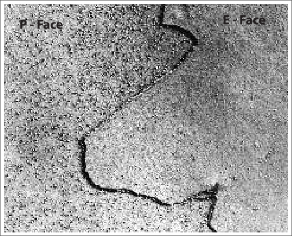

在这张图片中可以看到细胞膜上有很多微小的结构：

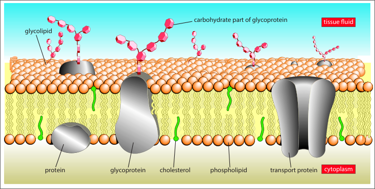

### Fluid mosaic model 流动镶嵌模型

1. Made of a **phospholipid bilayer**
2. Contain **scattered proteins** (mosaic)
3. Both the phospholipids and proteins can **move about by diffusion** (fluid)
4. **Cholesterol** molecules fit between phospholipid molecules

细胞膜不是一个固定的结构，它是一个“有弹性的”，所以科学家提出了流动镶嵌模型。小分子（比如水分子）可以直接通过细胞膜，也就是phospholipid之间的间隙。也有一些大分子会通过细胞膜上的“蛋白质通道”来进出细胞，这种通过是carrier protein或者叫transport protein。

This model can explain:

- Passive and active movement between cells and their surroundings
- Cell to cell interactions
- Cell signalling

### Feature and Role of Cell Membrane

- Partially permeable / semi-permeable
  1. water is small enough to move through
  2. non-polar, hydrophobic, lipid-soluble molecules such as $ O_2 $  and $ CO_2 $ can move across the fatty acid interior and the membrane
  3. Polar, hydrophilic, water-soluble molecules and ions cannot move across the fatty acid interior and they need transport proteins

### The Factors that Influence the Fluidity

- More Unsaturated the fatty acid tails, more fluid the membrane

  不饱和脂肪酸之间排列并不紧密，所以每个脂肪酸之间的间隙更大，也更方便移动。

- The shorter the fatty acid tails, the more fluid the membrane.

- More temperature, more kinetic energy, more fluid membrane

- Cholesterol is important for the mechanical stability of membrane at high / low temperatures:

  - At low temperature, the membrane is less fluid. Cholesterol prevents close packing of fatty acid tails, increases fluidity and maintains the correct fluidity of the membrane.
  - At high temperature, the membrane is more fluid. Cholesterol reduces mobility of phospholipids and decreases fluidity

## The roles of the molecules found in membranes

**Phospholipids** - Form a phospholipid bilayer

**Cholesterol** - Increase the fluidity at low temperature

### Proteins

1. Transport protein - active transport

   - Channel protein
   - Carrier protein

2. Enzyme - help metabolic mechanics

   - Digest
   - Catalyse

3. Some proteins attach to cytoskeleton - help to maintain the shape of the cell, or involve in changes of the shape of the cell

   > Cytoskeleton is made of microtubulus

### Glycoproteins and Glycolipids

1. **Receptor molecules** for cell signalling

2. Act as **markers** or **antigens**, allowing cell to cell recognition

   > 不同的血型是因为glycoproteins和glycolipids不一样.

## Cell signalling

Main 3 stages of cell signalling:

1. Reception
2. Transduction
3. Cell Response

当一个endocrine cell分泌（释放出）激素，激素会通过血液移动到靶细胞（目标细胞）。靶细胞细胞膜上的protein receptor会接受到信号:

1. A stimuli causes another cell to secrete ligand

2. The ligand <u>travels in blood stream</u> to target cell

3. **ligand** reaches the receptor protein

   > Ligand 配体 - cell signalling molecule 用于传递信号的一种分子
   >
   > <u>Hormone is a type of ligand</u>, ligand is a general name for all the molecule that can signal a cell.
   >
   > The shape of ligand is **complementary** to the receptor in the cell surface membrane.
   >
   > If the ligand is hydrophobic, it can pass through the cell membrane freely, and don't need to bind with receptor protein.

4. When they bind together, the receptor will change shape

5. When the receptor changes shape / conformation, it will activate the **G protein**

6. <i style="opacity: 0.6">G protein changes shape and release GDP</i>

7. <i style="opacity: 0.6">GTP replaces the GDP in G protein</i>

8. <i style="opacity: 0.6">Then the G protein activates another protein</i>

9. And the G protein will produce **second messenger** 第二信使

10. Second messenger is produced to trigger an **enzyme cascade** 酶级联反应

11. Signal is amplified

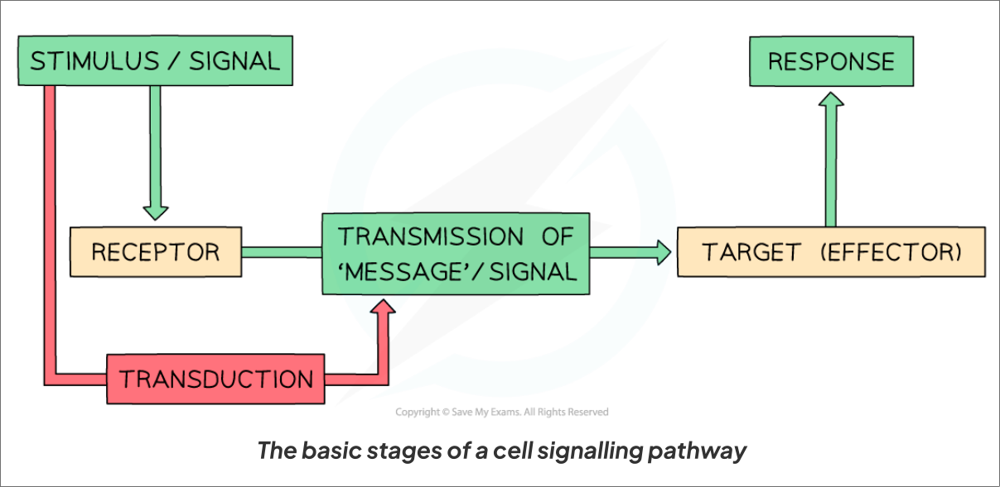

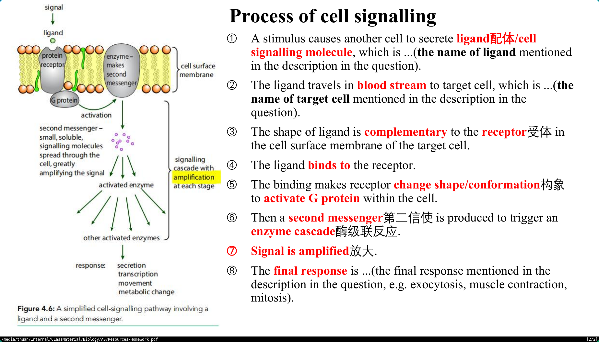

## Movement of Substances Across Membranes

Passive transport, <u>does not require the energy</u> from respiration:

- diffusion (simple diffusion)
- facilitated diffusion
- osmosis

Active transport, <u>requires the energy</u> from respiration:

- active transport
- bulk transport (endocytosis and exocytosis)

### Diffusion

Particles **move randomly** due to **kinetic energy** in them, eventually distribute evenly in the space. Diffusion is the **net movement** of molecules and ions from <u>higher concentration to low concentration</u> down a **concentration gradient**.

> Net movement - 用来描述粒子们整体运动趋势的单词

- Down the concentration gradient
- Passive / Don't require ATP
- Don't require transport protein
- Don't require semi-permeable membrane

Hydrophobic molecules can diffuse through the cell surface membrane, for example $ O_2 $ and $CO_2$

Factors affecting rate of diffusion:

1. Steepness of concentration gradient
2. Temperature - particles move faster when the temperature is high
3. The nature of the molecules or ions - some lighter molecules can move faster than some larger molecules, polar and non-polar also will affect the diffusion rate, non-polar molecules can diffuse through the cell surface membrane more easily than the polar molecules
4. <u>Surface area : Volume</u> ratio - larger the ratio, faster the diffusion rate
5. Distance - shorter the distance, faster the diffusion rate

> 如何快速计算<u>Surface area : Volume</u>：
>
> - 当两个长方体的体积相同，那么比较它们的边长，更长的一边意味着<u>更扁的形状</u>，也就是说面积更大。

> **Question**: Why the water can become coloured when the coloured plant cell is boiled?
>
> **Answer**: High temperature or alcohol denatures proteins and damage cell membrane, so the coloured pigments can diffuse out down the concentration gradient.

### Facilitated Diffusion

Facilitated Diffusion - the diffusion of molecule or ion through a **transport protein** (**channel protein** or **carrier protein**) in a cell membrane down their concentration gradient.

> Facilitated means making things easier to happen.

- Down the concentration gradient

- Passive, don't require extra energy

- Use transport protein (**specific** to a particular ion / molecule, only allow a certain type of particle to move through)

  > **Channel protein** has a <u>fixed shape</u>, usually used to transport ions.
  >
  > **Carrier protein** can <u>change their shape</u> to transport the molecules such as sugars and amino acids.

- Across a cell membrane

Factors affecting rate of facilitated diffusion:

1. Steepness of the concentration gradient
2. Temperature
3. Number of transport proteins available
4. surface area of the membrane (large surface area means more transport proteins, if the )

> **The difference between simple diffusion and facilitated diffusion:**
>
> 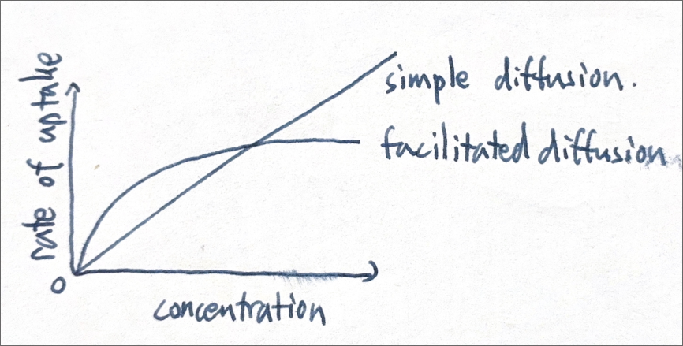
>
> For facilitated diffusion, the number of transport protein will become a limiting factor, and lacks the uptake rate.

### Osmosis

**water potential** 水势 - 可以简单理解为水分子的“浓度”，但是水所谓一个溶液不能通过“浓度”来描述，所以使用了这个特殊的词汇。溶液中溶质的浓度越高，水势越低:

- Pure water has the highest water potential: 0 kPa
- Dilute solution has a negative water potential: < 0 kPa
- Concentrated solution has a more negative water than dilute solution.

> The Greek letter psi, ψ, is used to present water potential

Osmosis is the net diffusion of **water molecules** (only occurs for water) from high water potential to low water potential, down a water potential gradient, through a partially / semi- permeable membrane:

- Down the water potential gradient
- Passive
- Don't require transport protein
- Across a partially permeable membrane

Two types of partially permeable membrane

- cell membrane 细胞膜
- Visking tubing / dialysis tubing 透析管

The pores of the Visking tubing membrane have a certain size, if the ions or molecules are smaller than the pores, the ions or molecules can move through the membrane.

- **Starch** is a large molecule, so starch usually can't move through the Visking tubing's membrane
- **Glucose** is a small molecule, so glucose can pass through

> 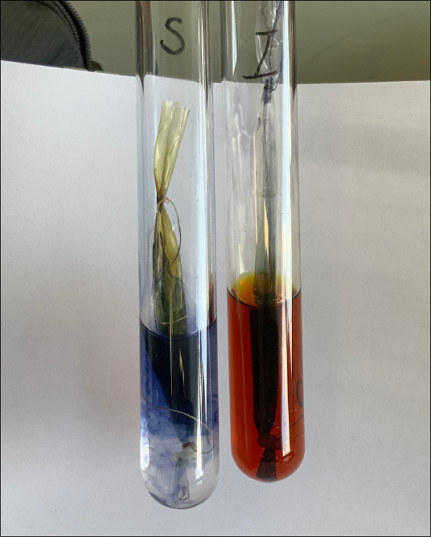
>
> | 试管           | 左试管（S）     | 右试管（I）     |
> | -------------- | --------------- | --------------- |
> | 试管中的溶液   | Starch solution | Iodine solution |
> | 透析管中的溶液 | Iodine solution | Starch solution |
>
> 在左试管中，starch不能进入透析管，但是iodine可以从透析管中出来，所以二者会在透析管外发生反应，在透析管外呈现出dark blue。
>
> 在右试管中，starch不能从透析管里出来，但是iodine可以进入透析管，所以透析管内会呈现出dark blue。

As the water moves into the cells through osmosis:

- **Animal Cell**: shrink → swell → burst

- **Plant Cell**: Plasmolysed → flaccid → turgid

| Water Potential                          | Water Movement         | Animal Cell | Plant Cell  |
| ---------------------------------------- | ---------------------- | ----------- | ----------- |
| High (Pure water)                        | Moves into the cells   | Burst       | Turgid      |
| Medium (Dilute Solution)                 | Balanced               | Swell       | Swell       |
| Low (Concentrated Solution)              | Moves out of the cells | Shrink      | Flaccid     |
| Very Low (More Concentrated Solution) | Moves out of the cells | Shrink      | Plasmolysed |

> **Incipient plasmolysis** is the point at which the protoplast is about to pull away from the cell wall (the point at which plasmolysis is about to occur). 
>
> 质壁分离发生的那一个点。
>
> 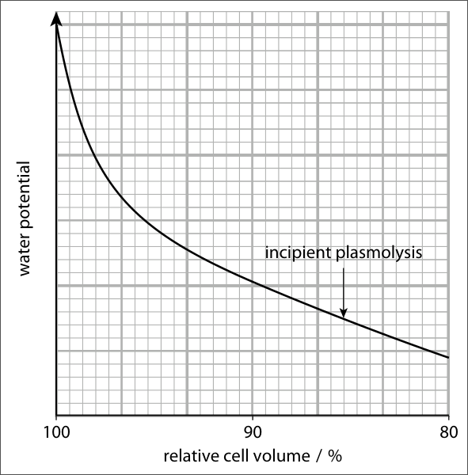

因为植物细胞的细胞壁比较坚固，所以当植物细胞水分丢失过多时，植物细胞的细胞膜会和细胞壁发生分离。

### Active Transport

The movement of molecules or ions through carrier proteins across a cell membrane, against concentration gradient, using energy:

- against concentration gradient (from low to high)
- active transport - require energy (ATP)
- Need cell membrane - carrier protein

Carrier protein can change its shape and take the molecule against the concentration gradient:

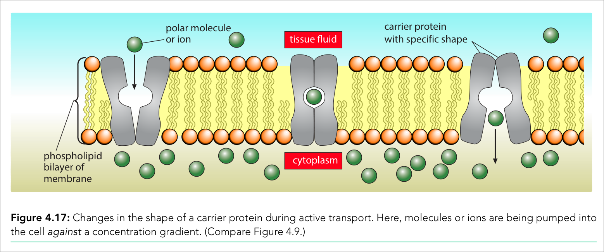

One example of carrier protein is **sodium-potassium pump**, it brings 2 $K^+$ into to cell and 3 $Na^+$  out of the cell by using 1 $ATP$ molecule each time.

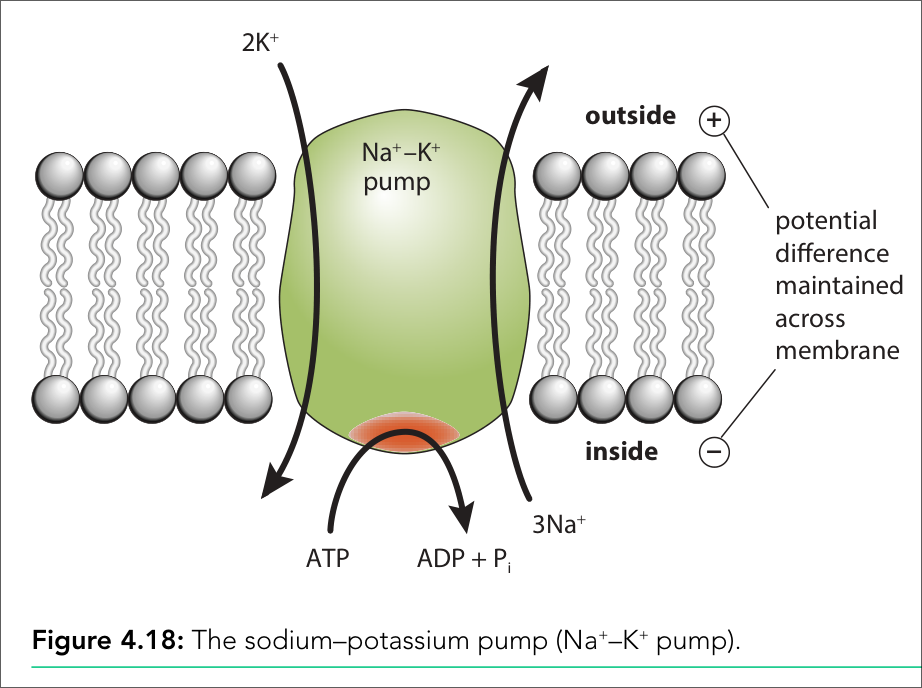

### Bulk Transport

Transport of **large quantities** of materials into and out of the cells. The materials include **large molecules** such as proteins oy polysaccharides, parts of cells, or even whole cell.

- Use energy
- Need membrane
- Endocytosis - moves into the cell
  - Phagocytosis - carry solid materials
  - Pinosytosis - carry liquid materials
- Exocytosis - moves out of the cell

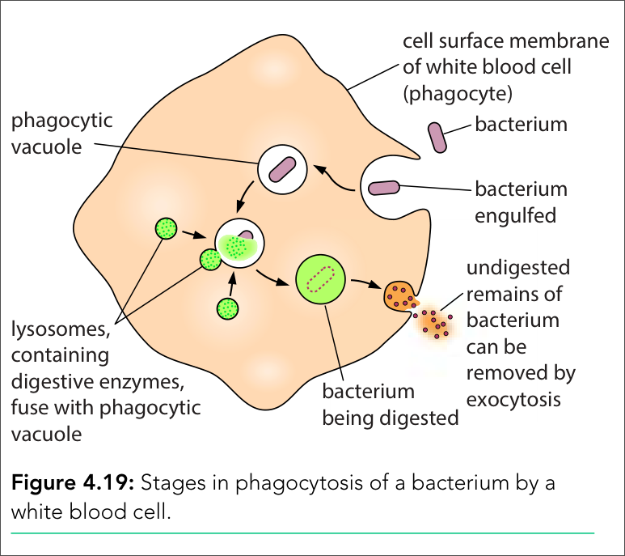

Bulk transport forms **vesicles** to transport the materials, instead of carrier proteins in active transport.

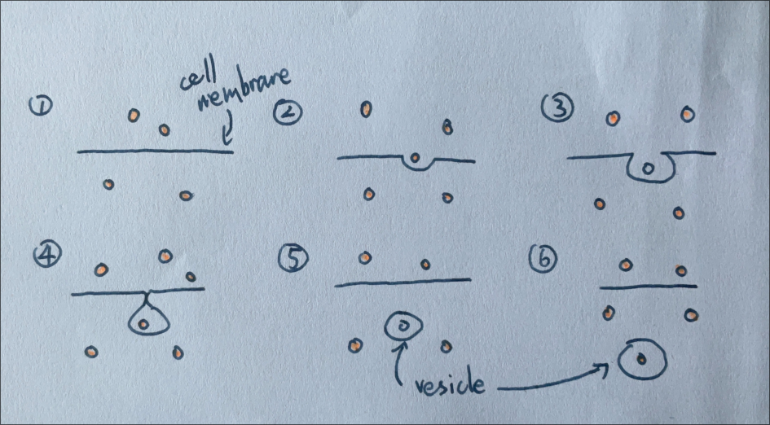
