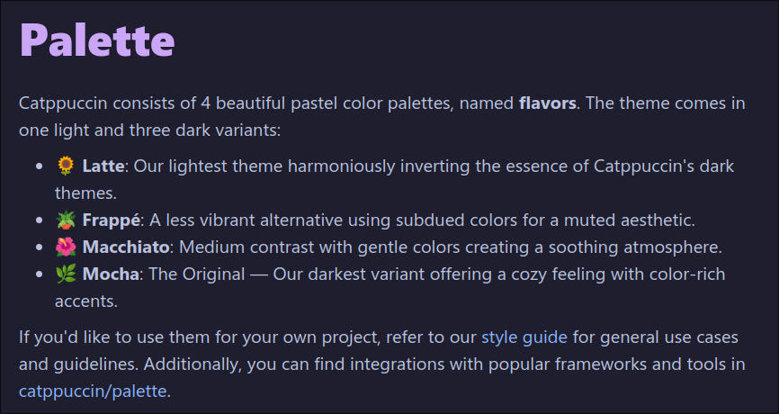
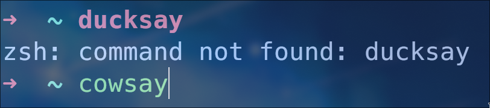
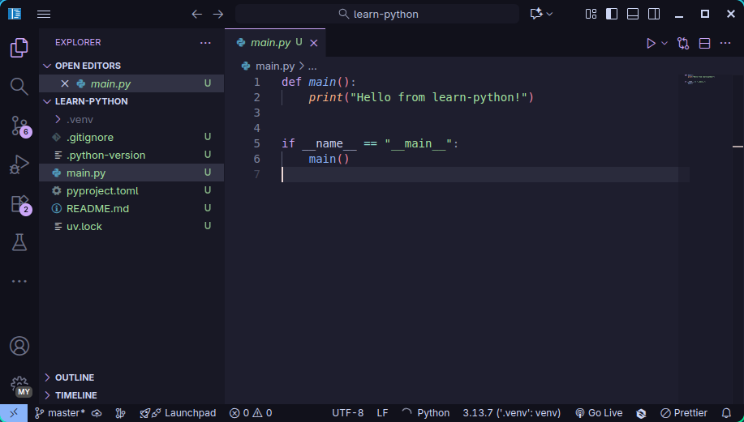

对于大多数人日常使用的电脑都能分为两种：Mac电脑和非Mac电脑，与其所对应的系统是MacOS和Windows系统。但这只是对个人电脑来说，世界上个各种服务器绝大多数使用的都是Linux系统。随着近些年Linux社区的发展，加上MacOS和苹果硬件的强绑定以及Windows各种莫名其妙的强制规定，让Linux即使是作为日常使用也十分方便。

同时，从根源上说，Linux和MacOS都属于“类unix”系统，所以有很多地方都是相同的，具体的介绍可以参考以下视频：

<iframe src="//player.bilibili.com/player.html?isOutside=true&aid=562892484&bvid=BV1Mv4y127wA&cid=899557207&p=1&autoplay=0" scrolling="no" border="0" frameborder="no" framespacing="0" allowfullscreen="true" style="height:360px; width: 480px"></iframe>

因为本人使用的是Linux，再加上身边有很多朋友用的都是MacOS，所以接下来的介绍将主要基于MacOS和Linux。至于Windows用户，我相信网上关于Windows的教程是最多的，很多操作都能找到相应的教程。

如果遇到GitHub访问问题的话，可以选择开梯子，或者了解下ghproxy或fastgit这种项目。

> [GitHub Proxy文件加速](http://gh.thyrius.top/) - 这是我在Cloudflare上建的一个ghproxy的worker，算是给其他的代理站分流了。

## 终端软件

接下来要安装的软件可能会比较多，而且很多并不是运行python代码必要的软件。但是说磨刀不误砍柴功，当把工具都准备齐全之后，把工具都调整成舒服的状态后，能很大程度上改善学习编程的体验。毕竟如果一直使用着自己不喜欢的工具，最后还能坚持使用下来，只能说是赤石大王级别的。

### 终端模拟器

现在的各种“终端软件”都不能算是严格意义上的终端了，它们都属于“终端模拟器”。

初次打开终端的时候会看到一个非常单调的界面，不够好用，或者说不够美观，所以我建议大家可以下载[iTerm2](https://iterm2.com/)这个软件来代替Mac默认的终端：

1. 前往官网下载：[iTerm2 - macOS Terminal Replacement](https://iterm2.com/)
2. 解压下载后得到的zip文件（如果是用Safari的话可能已经自动解压好了）
3. 把解压后的软件拖到“应用程序”文件夹中（位于访达的左侧边栏）
4. 之后就可以在启动台启动了

默认情况下iTerm2和自带的终端差别不大，界面的配色也不好看。大家可以选择到设置的界面设置中选择自己喜欢的配色，或者添加背景图片和背景透明度。我自己用的配色是[Catppuccin](https://catppuccin.com/palette/)的Mocha主题，大家可以参考官方的使用方式：[catppuccin/iterm: 🍭 Soothing pastel theme for iTerm2](https://github.com/catppuccin/iterm)



### Oh My Zsh

当挑选好了颜色之后，虽然看上去好看了一些，但是整体来说还是很难看：只有一个单调的“主机名”和一个“用户名”。接下来我推荐安装[Oh My Zsh](https://ohmyz.sh/)来获得更加美观实用的命令行界面：

1. 打开终端，将以下命令粘贴进去，按下回车执行

   > 官方安装方式（两个命令任选其一就行）：
   >
   > ```shell
   > sh -c "$(curl -fsSL https://raw.githubusercontent.com/ohmyzsh/ohmyzsh/master/tools/install.sh)"
   > sh -c "$(wget https://raw.githubusercontent.com/ohmyzsh/ohmyzsh/master/tools/install.sh -O -)"
   > ```
   >
   > 如果因为国内的网络原因导致安装失败的话，可以试试下面这两个命令：
   >
   > ```shell
   > sh -c "$(curl -fsSL https://gitee.com/mirrors/oh-my-zsh/raw/master/tools/install.sh)"
   > sh -c "$(wget https://gitee.com/mirrors/oh-my-zsh/raw/master/tools/install.sh -O -)"
   > ```
   > 如果在安装的过程中Mac有弹窗表示要安装一些额外的工具的话，选择安装即可。等安装完毕后再重新执行命令。
   >
   > 如果最开始没有安装的话可以使用这个命令直接安装：
   >
   > ```shell
   > xcode-select --install
   > ```

2. 如果要输入密码的话就输入你解锁电脑的密码，输入密码的过程不会显示出来，输入完成后按回车就可以了。之后如果其他情况还要输入密码的话也是同理。

如果不出意外的话会看到一个更加简洁的页面，通常是`➜  ~`，如果你的终端不支持显示`➜`的话可能只是一个方块和`~`。为了显示特殊符号，我推荐下载这个字体：

- [MesloLGS NF Regular.ttf](https://github.com/romkatv/powerlevel10k-media/raw/master/MesloLGS%20NF%20Regular.ttf)
- [MesloLGS NF Bold.ttf](https://github.com/romkatv/powerlevel10k-media/raw/master/MesloLGS%20NF%20Bold.ttf)
- [MesloLGS NF Italic.ttf](https://github.com/romkatv/powerlevel10k-media/raw/master/MesloLGS%20NF%20Italic.ttf)
- [MesloLGS NF Bold Italic.ttf](https://github.com/romkatv/powerlevel10k-media/raw/master/MesloLGS%20NF%20Bold%20Italic.ttf)

下载后双击安装，安装完成后在iTerm2中选择使用这个字体就可以了。

接下来可以安装一些比较方便的插件：

1. zsh-syntax-hilighting

   这是一个用于语法高亮的插件，如果我输入一个不存在的命令，这个命令会显示成红色，如果是一个存在的命令的话会显示成绿色:

   

   安装指令：

   ```shell
   git clone https://github.com/zsh-users/zsh-syntax-highlighting.git ${ZSH_CUSTOM:-~/.oh-my-zsh/custom}/plugins/zsh-syntax-highlighting
   ```

2. zsh-autosuggestion

   这是一个自动补全插件，能记录你之前输入的命令，之后你再重新输入的话能给你匹配你之前输入过的内容：

   

   安装指令：

   ```shell
   git clone https://github.com/zsh-users/zsh-autosuggestions ${ZSH_CUSTOM:-~/.oh-my-zsh/custom}/plugins/zsh-autosuggestions
   ```

执行完上两个命令后只是下载完成了，之后还需要让zsh知道要使用这两个插件：

1. 可以输入`open -a TextEdit ~/.zshrc`来打开zsh的配置文件

   > `.zshrc`以及其他`rc`或`.conf`结尾的文件一般称之为“配置文件”，更改配置文件本质上就是在设置一个软件。只不过通常我们有一个直观的图形设置界面，而它要在文件中更改设置。

2. 找到`plugins=(git)`这一行，在括号中添加`zsh-syntax-hilighting`和`zsh-autosuggestion`，之间通过空格隔开，例如：

   ```shell
   plugins=(git zsh-syntax-highlighting zsh-autosuggestions)
   ```

   或者说为了方便查看，写成这样子也可以：

   ```shell
   plugins=(
   	git
   	zsh-autosuggestions
   	zsh-syntax-highlighting
   )
   ```

3. 之后在终端中输入`source ~/.zshrc`或直接话，应该就生效了。

### Homebrew

现在你的终端应该配置得差不多了。之后会用到很多在终端中使用的软件，比如：

- `python3`: 用于运行Python代码的程序
- `git`：一个版本控制软件，但是对于初学者来说一般只会用这个软件来下载别人的项目
- `wget`：终端中的下载工具
- `neovim`：终端中的文本编辑器（学习难度较高）

随着学习的深入，还会使用到很多很多其他的软件，为了方便统一地管理，我推荐安装[Homebrew](https://brew.sh/)来自动化管理。可以通过以下的命令来安装：

```shell
# 官方安装命令
/bin/bash -c "$(curl -fsSL https://raw.githubusercontent.com/Homebrew/install/HEAD/install.sh)"
```

如果遇到网络问题的话可以使用以下的命令，或者参考清华大学的镜像[homebrew](https://mirrors.tuna.tsinghua.edu.cn/help/homebrew/)

```shell
/bin/zsh -c "$(curl -fsSL https://gitee.com/cunkai/HomebrewCN/raw/master/Homebrew.sh)"
```

只不过在国内使用的话还是没有特别稳定，因为很多通过Homebrew下载软件的话还是会用到GitHub，而GitHub在中国的访问非常玄学，有时候能直接进去，有时候死活进不去，有时候刷新一下就能进去。

> 由于我在Mac上用Homebrew已经是好几年前的事情了，我就找AI列了下Homebrew的常用指令：
>
> | 目的           | 命令                                          |
> | :------------- | :-------------------------------------------- |
> | **安装软件**   | `brew install <包名>`                         |
> | **安装应用**   | `brew install --cask <应用名>`                |
> | **卸载软件**   | `brew uninstall <包名>`                       |
> | **更新自己**   | `brew update`                                 |
> | **升级软件**   | `brew upgrade`                                |
> | **列出已安装** | `brew list`                                   |
> | **查看信息**   | `brew info <包名>`                            |
> | **搜索软件**   | `brew search <关键词>`                        |
> | **诊断问题**   | `brew doctor`                                 |
> | **清理空间**   | `brew cleanup`                                |
> | **管理服务**   | `brew services <start/stop/restart> <服务名>` |

## GUI软件

如果你已经安装成功了Homebrew后，那么接下来的这些软件都能通过Homebrew很方便地去安装。

以下是我建议必装的一些软件：

1. **VSCode**：主要用于写代码的一个软件，由Microsoft主要开发，拥有丰富的插件生态。

   ```shell
   brew install --cask visual-studio-code
   ```

2. **Python**：Python本体。Mac好像自带了python 3.9版本，可以通过`python3`这个命令使用，如果要安装更新版本的python的话可以通过以下命令安装：

   ```shell
   brew install python
   ```

   经过这个指令安装完后应该可以通过`python3`使用到最新版的Python。值得注意的是很多教程都会用到`python`或`pip`命令（现在不用知道具体是做什么的），在Mac上需要将对应的命令换成`python3`和`pip3`指令（如果没有特殊设置过的话）

3. **uv**：一个用于管理python项目的软件，目前来说是我觉得最方便的一个，如果喜欢其他同类型工具的话选择其他的也行。不过在我之后的教程中会以这个工具为主：

   ```shell
   brew install uv
   ```

其他一些推荐的软件：

1. **IINA**：一个视频播放器，和VLC差不多，但是外观比VLC更加现代

   ```shell
   brew install --cask iina
   ```

   如果执意要使用VLC的话也可以：

   ```shell
   brew install --cask vlc
   ```

2. **Typora**：一个markdown笔记软件，非常建议大家去学下markdown的基本使用方法，绝大多数情况下比Microsoft Word之类的软件好用多了。这篇文章是用markdown写的，我自己其他的笔记也都是用markdown写的。

   ```shell
   brew install --cask typora
   ```

   只不过这个软件是付费软件，所以如果不自己去找那种破解版的话，可以看看其他的笔记软件。

   Markdown教程可以参考以下的视频：

   <iframe src="//player.bilibili.com/player.html?isOutside=true&aid=114890693938496&bvid=BV1V4gVzBEGT&cid=31187471534&p=1&autoplay=0" scrolling="no" border="0" frameborder="no" framespacing="0" allowfullscreen="true" style="height:360px; width: 480px"</iframe>

   我用这个软件是因为它是真的好用，而且因为一些特殊的个人喜好原因不想用Obsidian和Notion。

3. **Obsidian**：一个非常流行的全平台笔记软件，同样以markdown语法作为基础，但是在原本的基础上增加了很多强大的功能，它还有非常丰富的插件系统：

   ```shell
   brew install --cask obsidian
   ```

4. **Notion**：同样是一个非常流行的全平台笔记软件，有很多人通过Notion来建立自己的“知识库”：

   ```shell
   brew install --cask notion
   ```

5. **Raycast**：一个代替Mac自带的Spotlight的工具，插件系统也很丰富：

   ```shell
   brew install --cask raycast
   ```

   同类型的软件还有Alfred，但是这个软件好像是要付费的：

   ```shell
   brew install --cask alfred
   ```

   个人感觉Raycast挺好用的，之前刷到过很多推荐Raycast的视频但是因为电脑太旧了导致一直没办法体验：[最强macOS生产力软件：Raycast](https://www.bilibili.com/video/BV1Uo4y137XH/?spm_id_from=333.337.search-card.all.click&vd_source=95a8a5f89540f816d1ca48c938e432bf)

## 创建Python项目

如果你安装好uv后，可以通过uv来创建一个简单的python项目：

1. 打开终端

2. `mkdir ~/Documents/Python`：创建新文件夹

   这个命令会在“文档”文件夹下创建一个名为`Python`，专门用来存放python项目的文件夹。在编程中，文件夹（folder）更专业的叫法是“目录”（directory），之后也都会使用“目录”这个词。`mkdir`这个命令本身就是“<u>M</u>a<u>K</u>e new <u>DIR</u>ectory”。

3. `cd ~/Documents/Python`：使用`cd`（change directory）命令切换到新创建的目录。

4. `uv init learn-python`：通过`uv`创建一个名为`learn-python`的python项目

5. `cd learn-python`：切换到这个新创建的项目

6. `uv run main.py`：运行自动生成的示例代码

如果看到类似于以下的内容的话就说明创建成功了：

```txt
Using CPython 3.13.7 interpreter at: /usr/bin/python3.13
Creating virtual environment at: .venv
Hello from learn-python!
```

第一行的内容是说这个项目是使用哪个python版本，第二行是说`uv`为当前项目创建了一个叫`.venv`的”虚拟环境“，在一个虚拟环境中做的修改不会影响到其他项目，同理，在别的项目中做的修改也不会影响到这个项目。第三行则是`main.py`这个python脚本实际输出的东西。

如果再次运行同样的命令就只会得到`main.py`中输出的内容了。原本第一第二行中输出的信息只会在第一次运行时输出。提示，可以在上端中按下”上“键来快速输入上一次的指令。

```txt
➜  learn-python git:(master) ✗ uv run main.py         
Using CPython 3.13.7 interpreter at: /usr/bin/python3.13
Creating virtual environment at: .venv
Hello from learn-python!
➜  learn-python git:(master) ✗ uv run main.py
Hello from learn-python!
```

如果没问题的话可以通过以下命令来让VSCode打开这个新创建的项目：

```shell
code .
```

> 如果提示说找不到`code`这个命令，就说明默认情况下不支持通过从终端打开VSCode，我被信息差了（在我这边可以通过`code`命令打开VSCode）



这个`main.py`文件里面的内容就是python的脚本了，自动创建的项目有以下文件：

```txt
.
├── .git/
├── .gitignore
├── main.py
├── pyproject.toml
├── .python-version
├── README.md
├── uv.lock
└── .venv/
```

- `.git`目录下放的是有关版本控制的内容，如果会使用git的话可以通过git来进行版本控制，记录你的更改。但是如果不会的话也问题不大，现在也不需要去学，以后有使用的需要的话自然就学会了。

- `.gitignore`文件中记录着要在git需要忽略的文件或目录

- `main.py`是主要的python文件，代码主要往这个文件里写

- `pyproject.toml`储存着有关这个项目的各种信息

- `README.md`是通过markdown写的一个“自述文件”，一般写着有关于一个项目的介绍和使用说明

  > `README.md`自述文件是一个项目的核心说明书，它采用易读写的 Markdown 格式编写，通常位于代码仓库或软件项目的根目录。当你创建任何一个需要被他人或自己未来理解和使用的项目时，就应当编写它，尤其是在项目开源、共享或协作之前。编写时，你只需创建一个名为`README.md`的文本文件，并清晰地阐述项目标题、简介、安装步骤、使用教程以及许可证等关键信息即可，其核心在于通过简洁的结构化内容让读者能快速上手。

- `uv.lock`储存着uv管理项目所需的一些信息

- `.venv`目录下放的是这个项目用到的python虚拟环境（Virtual Environment）

在上面通过`uv run main.py`时uv自动使用当前环境运行`main.py`文件。但是在有些时候手动激活环境的话会更加方便，这样还可以使用环境中的一些自带的工具（有时候会有）：

```shell
source .venv/bin/activate
```

