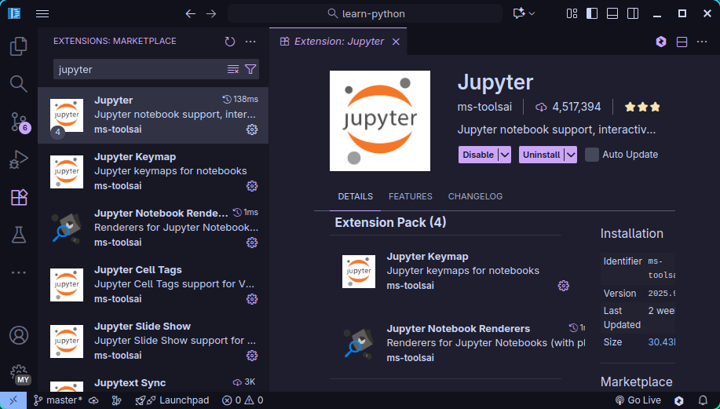
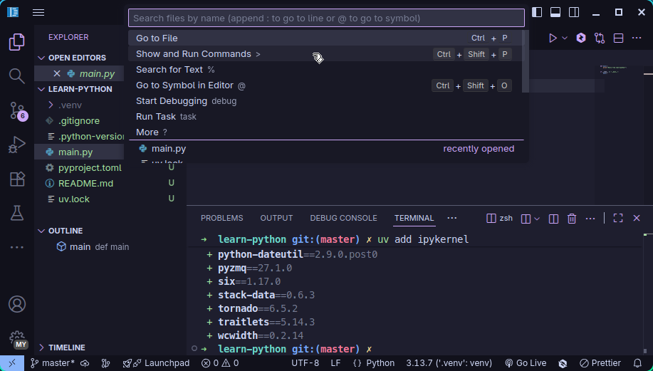
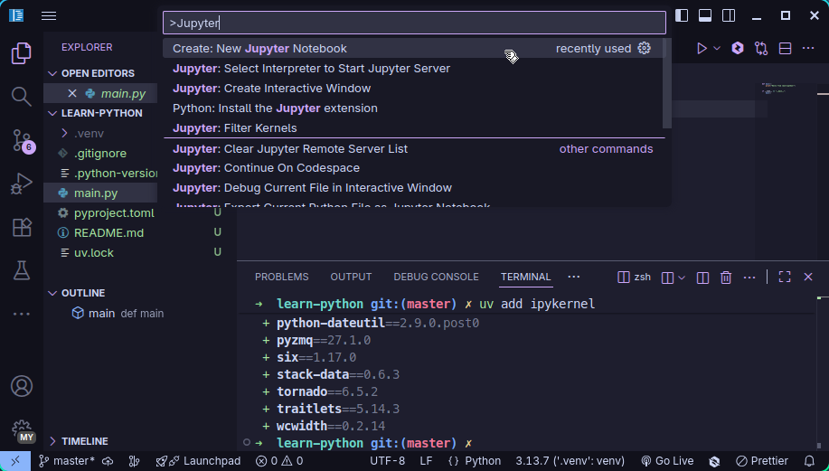
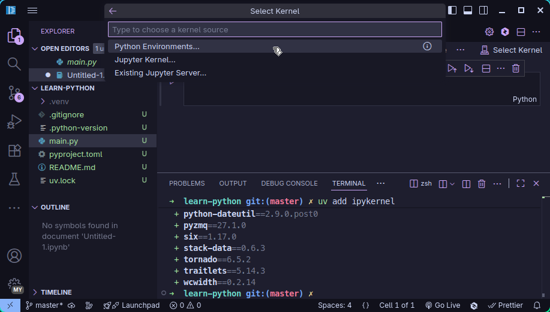
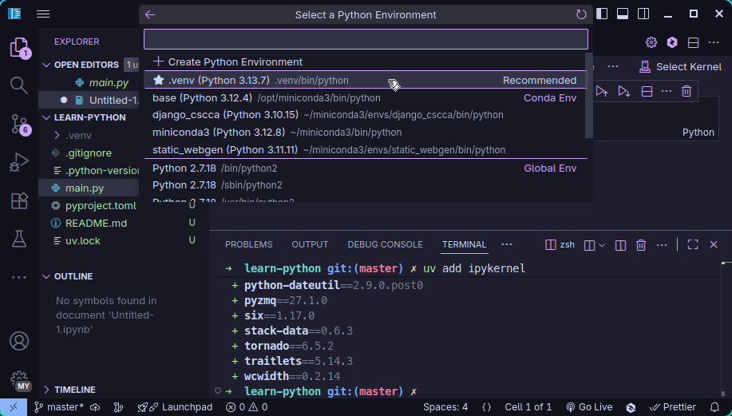
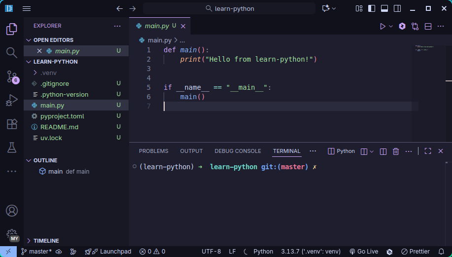
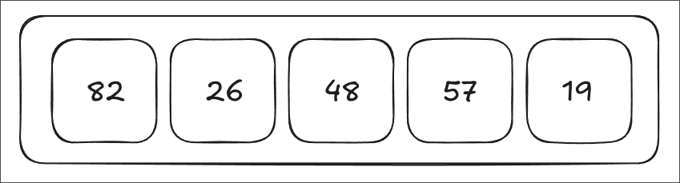
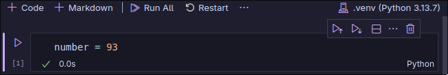
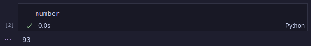

> [!CAUTION]
> 本片内容还在完善的过程中，请以更新的版本为准。

在上一讲的最后，我们创建了一个名叫做`learn-python`的项目，里面有python的环境，以及一个默认创建的`main.py`文件。在这一讲中，我们不会用到`main.py`文件中的内容，所以你把这个文件里的内容删了也没事。

为了在vscode中舒服地写python代码，建议装一些vscode的插件。要安装插件的话，可以点击左侧侧边栏的按钮来打开插件管理页面。搜索并安装你想要的插件就行了，比如说python：


另外，我还推荐安装一下Jupyter这个插件：



Jupyter Notebook是能让你更直观地看到代码运行的原理。

> 要使用Jupyter Notebook，你首先需要在环境中安装`ipykernel`：
>
> 1. 在终端中执行`uv add ipykernel`
>
> 2. 点击VSCode最上方的搜索栏，选择`Show and Run Commands`
>
>    
>
> 3. 搜索`Jupyer`并执行`Create: New Jupyter Notebook`命令
>
>    
>
> 4. 在右上角“Select Kernel"选项中选择`.venv`作为python环境
>
>    
>
>    

VSCode中有内置的终端模拟器，可以在左上角导航栏选择`Terminal > New Termainl`打开，这样打开的终端会和VSCode有一定集成。不过你如果喜欢其他终端，只要按照你喜欢的来就行了。

最后你会在这样的一个界面中写代码：



## 基本概念

编程中，主要有以下几个概念：

1. Variable 变量 - 用于存储数据
2. Control Structure 控制结构 - 决定代码的结构
3. Operator 运算符 - 做计算

### 变量

首先是变量，你可以把变量想象成一个有标签的盒子，里面可以放各种物品，比如：数字、单词以及你能想到的任何数据。


同理，你也可以把许多变量放在一个变量里，这样的东西在python里被称为“list 列表”。



---

在python中，要创建一个变量，首先需要给变量起个名字：

```python
number
```

然后再通过`=`将数据放到这个变量中。这个操作被成为“Assign 赋值”：

```python
number = 93
```


你可以在Jupyter Notebook中尝试这个命令:



在下面新建一个code cell后输入变量的名字就能直接查看变量的内容：


