MC联机这个问题，可以主要分为两个问题：首先你能进得去MC，然后还得在至少两台计算机之间建立连接。

> [!IMPORTANT]
>
> 本篇文章默认的MC默认指的是Java版的Minecraft。

这个文章被我分成了三个部分，每个部分都是完成一个小目标：

1. 安装好MC，能进游戏
2. 安装zerotier，为和朋友联机打下基础
3. 具体联机的方法

## 安装MC

如果要从[Minecraft的官网](https://www.minecraft.net/zh-hans)上买的话，原价要七十多好像，而且买起来比较复杂，官方启动器还不支持模组。所以一般来说，我们都是下载第三方启动器来玩MC。一般来说如果不是要加入一些大型的服务器和其他人一起玩的话，有没有正版的MC账号影响都不大。

考虑到MC是个跨平台的游戏，启动器最好也是跨平台的话比较好。我自己比较常用的是[HMCL](https://hmcl.huangyuhui.net/)，但如果你只用Windows平台的话，也可以考虑[PCL CE](https://pclce-web.demo.fis.ink/)，不过我本人不用Windows，所以也没试过PCL。

你可以直接去[HMCL官方的下载页面](https://hmcl.huangyuhui.net/download/)，然后选择对应的系统下载即可。

> 如果不想用那个城通网盘下载的话，可以下载开发版（

下载完成后，第一次打开时会让下载一些依赖，这个过程只要等待就可以了。进去后，你应该能看到**类似于**这样的界面（稍微有点差别是正常的）。

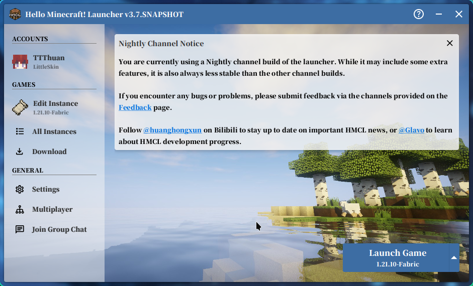

然后你需要创建一个账号：

1. 在左上角打开“账号”这一栏
2. 选择添加“离线账号”
3. 填入你想要的账号名字就可以了（注意只能是英文字母或数字）。

接下来下载MC本体，这里以下载最新版为例：

1. 点击左侧“游戏”一栏下的“下载”按钮

2. 点击最新版本

   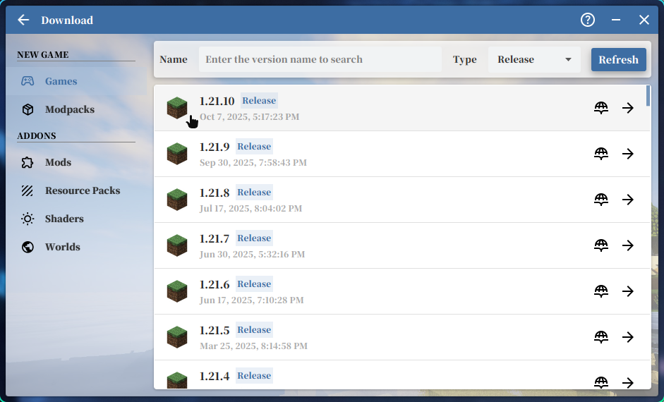

3. 在上方“实例名称”中填入你想要的名字，用于区分未来多个MC版本

4. 如果你没有一些特别想玩的模组，可以点开下方“Fabric”一栏，选择最新的一个安装

   > Fabric是一个MC模组加载器，你未来可以安装很多基于Fabric开发的模组。现在有很多好用的优化模组都是基于Fabric的，所以如果没有一些特别想玩的模组，可以无脑选择Fabric。

5. 选择完成后，选择右下角的“安装”开始安装

正常情况下，进度条跑完后会回到主页面，在这里你先不要急着启动游戏，先要打开版本隔离：

1. 打开左侧的“实例列表”
2. 选择你刚刚下载的版本
3. 在设置页面中启用“实例特定游戏设置”
4. 在下面版本隔离中选择“各实例独立”

在同一个设置页面中，可以选择右下角的“测试游戏”，看看能不能打开。

如果是第一次玩的话，大概率会提示没有安装Java，要不要自动安装。这里选择自动安装即可，但如果自动安装不成功的话，你需要去Java的官网下载你需要的Java版本。

一般情况下选择你最新版本的Java（在下载页面中显示的名称是“JDK”）。打个比方，如果你是Windows系统的，就可以下载这个Windows系统的`x64 Installer`:

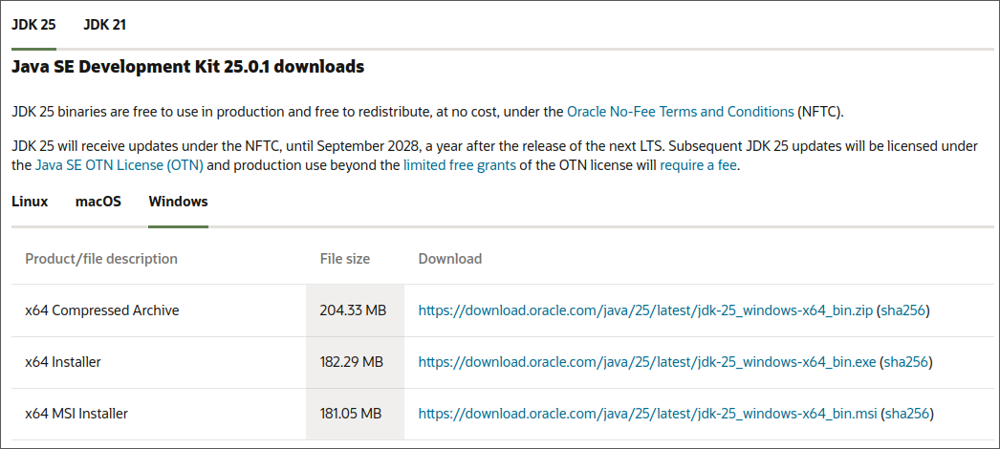

这个下载的话比较方便，在安装完成后，记得重启电脑，之后再次打开HMCL的时候应该就能自动识别到Java了。

> 安装过程基本上一路默认就行了，有几点需要注意个：
>
> - 如果问你是否要将Java加入到PATH（或环境变量中），记得选择勾选
> - 如果问你安装路径的话，你最好保持默认的安装路径，同时记录下安装的位置

如果打开后识别不到的话，可以按照在安装过程中记录下的Java安装路径，手动选择你的Java。（本人手边没有Windows电脑，所以具体会发生什么也不清楚，如果遇到问题的话可以去问你其他玩MC的朋友）

**如果之前都没问题的话，你应该是已经可以进入游戏了。恭喜你完成第一阶段。**

## 连接zerotier

zerotier是一个“虚拟组网”的方案，就正常情况下你和你朋友的电脑无法互相找到，但是安装了zerotier，加入了同一个网络后就可以看到对方了。

Zerotier会创建一个“虚拟网络”，然后让别的设备加入这个虚拟网络，这样就能让一个网络中的不同设备看到对方了。

首先，你要下载zerotier的软件，这个软件相当于一个入口，让你的电脑进入一个“虚拟网络”。去官网选择对应的系统下载并安装即可：[ZeroTier | Download ZeroTier for All Platforms](https://www.zerotier.com/download/)。

下载完成后还有两步，一个是要创建一个网络，一个是加入一个网络。不过只要联机的话，有一个人创建zerotier网络就够了，是不是服主都没问题。

### 创建网络

> 针对于创建网络的人

进入zerotier官网，选择[新建账号](https://central.zerotier.com/)，用邮箱注册即可。

进到管理页面后，你会有一个默认的网络`my-first-network`，点进这个网络。

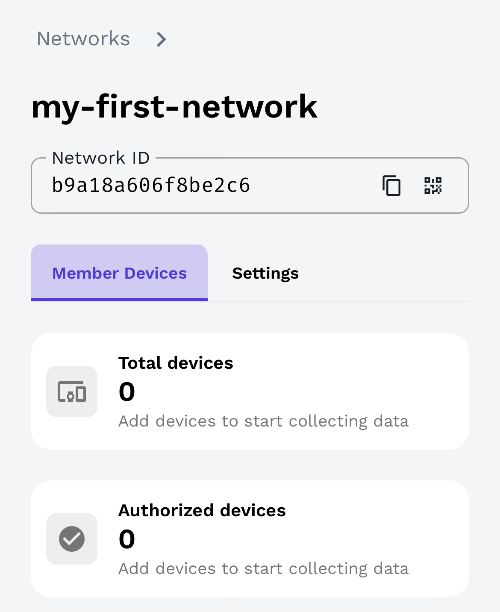

然后你需要把你创建的网络ID发给别人。

### 加入网络

> 针对于所有人

Mac用户和Windows用户的操作应该差不多。

你首先要找到并打开ZeroTier UI这个软件，点开后应该只是一个菜单的形式：

- 在Mac上位于右上角状态栏那边
- 在Windows上位于右下角应用小图标那边

选择加入网络：

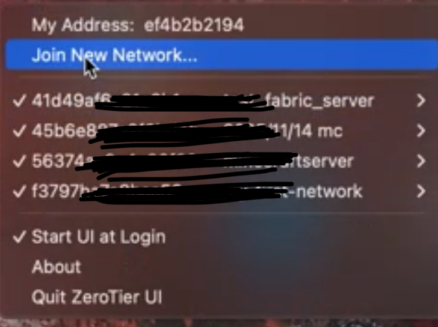

并在弹出的窗口中输入你要加入的网络ID：


> 之后，创建网络的需要重新刷新网页中zerotier网络的管理页面，此时应该会出现一个新设备加入的请求，确认这个设备就是要加入的设备后，选的允许通过就可以了

当网络创建者同意加入后，你重新点开zerotier的菜单，就可以看到你多出了一个新的网络。

然后，你可以参考以下方式找到你在虚拟网络中的IP地址。

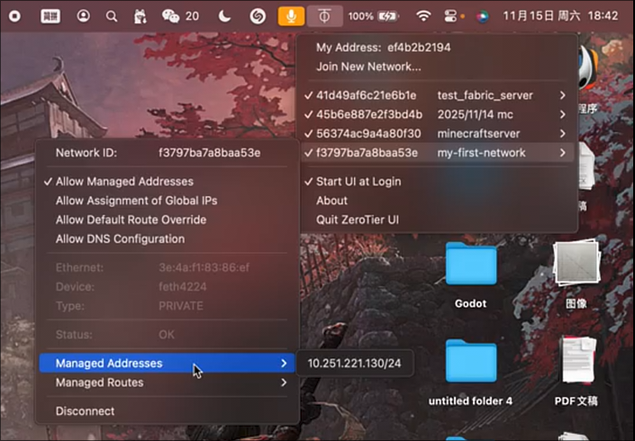

在上面的例子中，这台设备在`my-first-network`中的地址是`10.251.221.130`。

### 测试网络连通性

接下来需要你和你的朋友在这个网络中互相“找到”对方，并测试彼此之间是否能够通信。

作为补充，你可以看下AI对于IP地址的解释：

> 你可以把一个网络（比如我们刚刚创建的 Zerotier 虚拟网络）想象成一条巨大的“数字街道”。这条街道上有很多“房子”（也就是我们每个人的电脑、手机等设备）。为了让数据包（比如你朋友在游戏里的位置信息）能够准确无误地送到你的电脑上，就需要一个唯一的标识，这就是 **IP 地址**。
>
> 简单来说，**IP 地址就像是你的设备在网络这条“街道”上的“门牌号”**。知道了这个门牌号，其他设备才能把信息准确地发送给你。
>
> 在我们使用 Zerotier 组建的网络中，每台加入的电脑都会被自动分配一个这样的“虚拟门牌号”（一个特定的 IP 地址）。你可以在 Zerotier 的管理后台看到所有设备的 IP，也可以在你自己电脑的 Zerotier 客户端菜单里看到你被分配到的 IP。

当你和你的朋友都有了自己在网络中的IP后，你们可以先试试彼此之间是否可以发现对方。

有一个工具叫作`ping`，它能够用于测试两个设备之间的连接，使用方式如下：

1. 打开你系统的终端

   - Windows: 按下键盘上的 `Win + R` 键，输入 `cmd`，然后按回车
   - 打开“终端”（Terminal）应用程序

2. 输入 `ping`（注意 ping 后面有一个空格），然后输入你朋友的 Zerotier IP 地址

   > 例如你朋友的IP地址是`10.251.221.130`，你需要输入以下的内容：
   >
   > ```bash
   > ping 10.251.221.130
   > ```
   >
   > 按下回车后，你如果出现了类似于下面的内容，说明你就连接成功了：
   >
   > ```txt
   > PING 10.251.221.130 (10.251.221.130) 56(84) bytes of data.
   > 64 bytes from 10.251.221.130: icmp_seq=1 ttl=64 time=11.1 ms
   > 64 bytes from 10.251.221.130: icmp_seq=2 ttl=64 time=55.6 ms
   > 64 bytes from 10.251.221.130: icmp_seq=3 ttl=64 time=74.3 ms
   > 64 bytes from 10.251.221.130: icmp_seq=4 ttl=64 time=11.3 ms
   > ```
   >
   > 这个命令会一直测试两台设备之间的连通性，你认为已经能连上后就可以通过按下`Control + c`键来退出这个命令。（注意在所有系统上都是使用这个命令，包括MacOS）

如果一切正常，那么你们可以进入下一步了。

## MC联机

如果你和你的朋友都是正版账号，你想把你的开的世界分享给别人加入的话，只需要进入世界后，按下`Esc`打开菜单，选择“对局域网开放”即可。

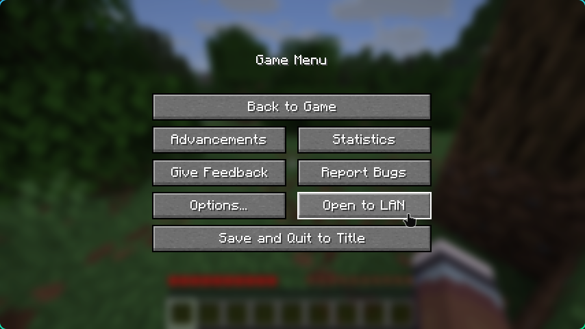

开放世界后，你你会看到游戏在聊天框中发了一条消息，类似于“游戏在`25565`端口上开放”的消息，这里的端口上不唯一。你需要把你的端口号告知你的朋友，你的朋友需要你的IP地址加端口号加入世界。

### 离线账号联机

如果你没有正版的话，还需要去下载一些专门的模组：

1. 退出游戏，打开HMCL

2. 点开你的MC示例（就是在下面这个地方的东西）

   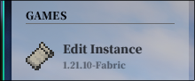

3. 打开左侧的“模组”选项

   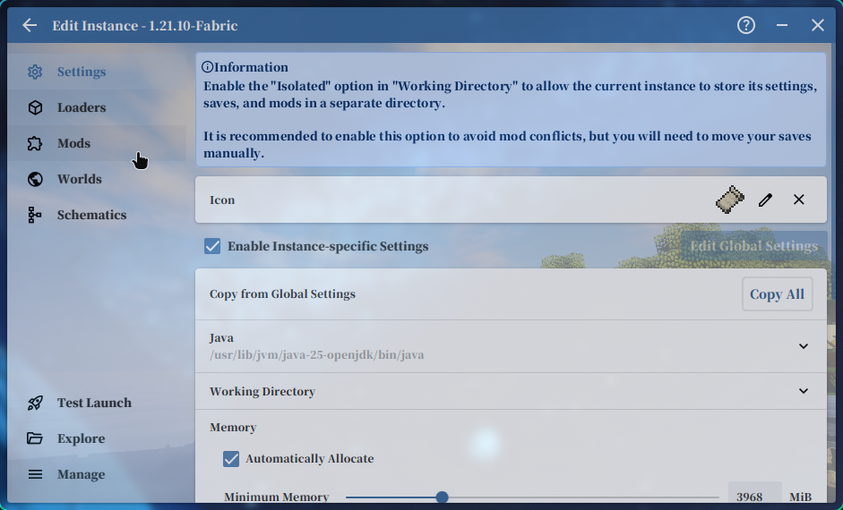

4. 选择上方的下载选项：

   

5. 搜索与你MC模组加载器兼容的联机模组：

   - Fabric - 如果你在之前步骤中选择的和我一样，都是Fabric的话，可以使用“LAN World Plug-n-Play”这个模组：

     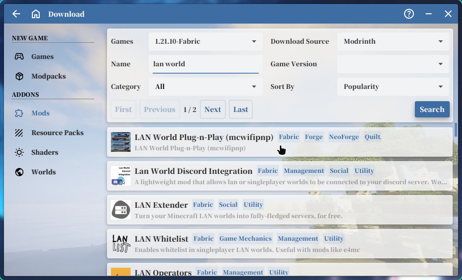

     然后点开选择对应的版本安装就行了（一般会有推荐的版本，大多数情况用推荐的版本就行了）

     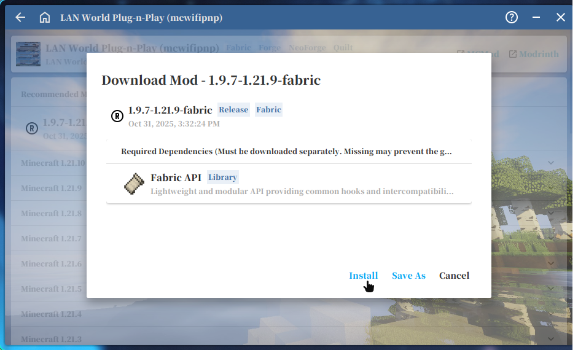

     这个模组提到，它还需要一个叫做“Fabric API”的前置模组，那么通过同样的方式安装“Fabric API”即可。

     所以说，你安装成功后，应该会有两个模组：

     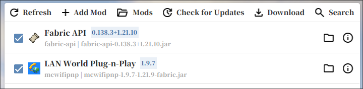

   - 如果你用的是Forge的话，可以看看“EasyLAN”或“LAN Server Properties”这两个同类型的模组。

模组下载完成后，你还是正常进入你的世界，然后同样选择“对局域网开放”

在新弹出的窗口中，可以做一些基本的设置，比如把端口号改成`25565`这个最常用的端口号之类的。

***很重要的一点是，你一定要将“Online Mode”改成“Disable”，不然你的朋友还是进不来。***

> [!IMPORTANT]
>
> **一定要将“Online Mode”改成“Disable”**
>
> **一定要将“Online Mode”改成“Disable”**
>
> **一定要将“Online Mode”改成“Disable”**

下一步就正常开放世界即可：“Start LAN World”

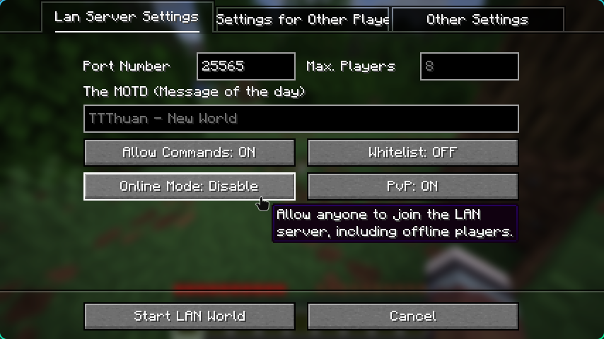

### 加入世界

然后你的朋友在多人联机中选择添加服务器，输入你的`IP地址:端口号`这个格式就可以加入了：

> 例如你的IP地址是：`10.251.221.130`
>
> 你的端口是：`25565`
>
> 那么你的朋友就要输入`10.251.221.130:25565`作为服务器地址（格式不能错，`:`必须要用英文的）。

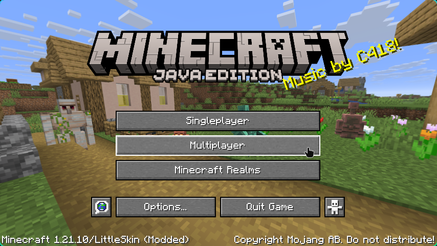


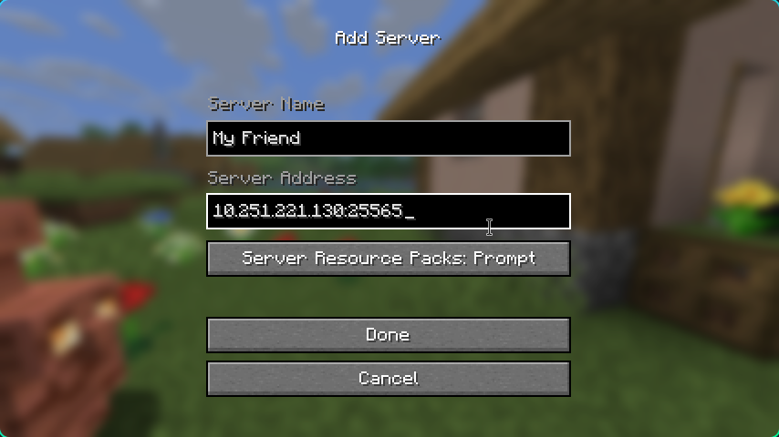

## 尾声

如果没出问题的话，你和你的朋友应该已经可以联机了。（如果没有的话，可以把错误的地方发给我，我会修改这个教程的）

要是想在离线账号上使用皮肤，你可以创建一个[LittleSkin](https://littleskin.cn/)的账号，使用这个网站上的皮肤。（个人很推荐）

