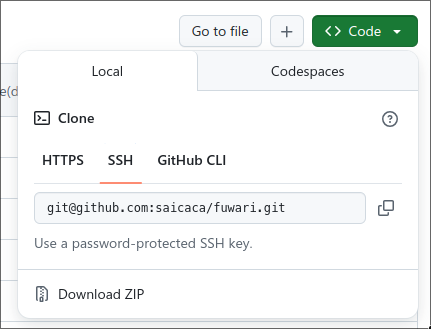
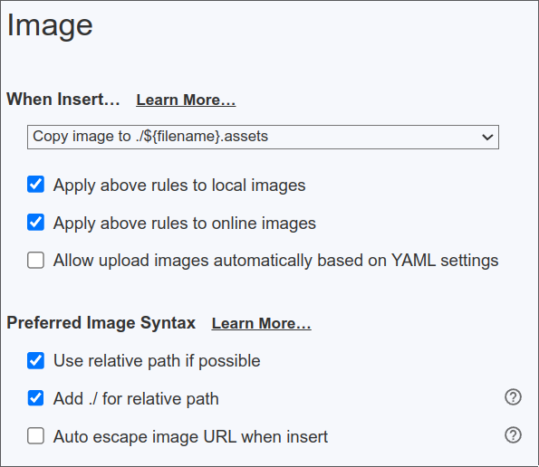

首先，这个博客用的框架是[Astro](https://astro.build/)，主题是[Fuwari](https://github.com/saicaca/fuwari)。然后将这个博客的源代码放在GitHub上，在通过Cloudflare的Pages功能生成静态网页和相应的域名。

配置完成后，每次要新增文章（post）的话只需要运行一个脚本（并被我绑定了快捷键执行），然后通过这个脚本创建新的post。发布的话我通过zoxide快速切换到本博客的根目录，然后`git commit -m "$(date) update" && git push`同步到GitHub上。之后Cloudflare会自动检测GitHub仓库的更新，然后自动生成更新后的内容。

通过Fuwari搭建的教程有很多，这里就不多重复别人的内容了。我参考的教程是B站[二叉树树](https://space.bilibili.com/325903362)的博客[Fuwari静态博客搭建教程 - AcoFork Blog](https://blog.2b2x.cn/posts/fuwari/)，我这边就提下需要注意的地方。

## GitHub相关

当你把模板仓库复制到自己的账号下时，可以把仓库的名称改为你希望的域名，比如说我希望我的域名是`ttthuan-blog.pages.dev`，那么我仓库的名字就可以设置成`ttthuan-blog`。这一点和Cloudflare自动分配的域名有关。不过如果你自己有域名的话可以忽略这一点，也可以视情况把这个仓库设成私人仓库。

GitHub这个网站在国内经常无法访问，但是过段时间就可以正常访问了，所以如果进不去的话可以过个几分钟再试试。当你通过git克隆到本地时记得通过的方式SSH，虽然上面的教程说是推荐SSH，但是我强烈建议使用SSH连接，之后推送更改的时候就不容易发生网络问题，导致无法正常推送。

如果没有配置SSH的GitHub连接方式？去必应上搜“GitHub”和“SSH”等关键词来查查怎么配置吧。虽然可能会花点时间，但这一切都是值得的，之后可以一劳永逸地避免很多问题。

## 编辑时插入图片

这个教程中提到了在MarkText中导入图片的方式，因为本人使用的是Typora，就顺便分享下我Typora的图片导入设置吧：

我估计其他的编辑器也大差不差，反正有几点需要注意的：

- 使用相对路径

- 在相对路径前添加`./`

- 把图片复制进`./$(filename).assets`的话可以比较方便地管理每篇post的附件

- 如果你文章的名字中间有空格，比如说`My Blog.md`的话，图片会复制到`./My Blog.assets`中，这会导致图片的路径中出现空格。Typora可以自动处理这些空格，以便正确地渲染图片，但是fuwari无法自动处理，你需要手动将``中的空格替换成`%20`，也就是：``

  > 对于外部链接的话也同理，有时候fuwari无法处理有空格的链接，你需要将链接中的空格替换成`%20`

如果要使用开源的markdown编辑器的话我推荐MarkText和Obsidian，商业软件的话就Typora。

---

> 最后，我参考了以下大佬的博客改造：
>
> - [对Fuwari进行一些小的改动 - 伊卡的记事本](https://ikamusume7.org/posts/frontend/some_small_code_changes/)
> - [在Fuwari中添加评论功能(带黑暗模式) - 伊卡的记事本](https://ikamusume7.org/posts/frontend/comments_with_darkmode/)
